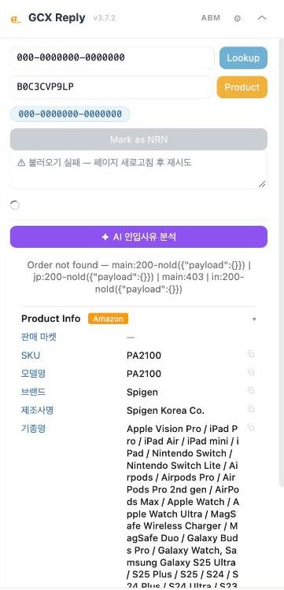

# Browser_Extensions

Browser-side tools for GCX agents: Tampermonkey userscripts, a paused MV3
extension port, and a small local backend.

## Screenshots

*GCX Reply panel*

| Item | What it is |
|------|------------|
| [tampermonkey_scripts/](tampermonkey_scripts/) | Installable userscripts: **GCX Reply** v3.7.2 (Zendesk order/product panel, Auto-Fill, MCF handoff, ABM relay to Seller Central), **Amazon MCF Autofill** v1.4.3, **Amazon JP MCF Autofill** v1.5.2, **Amazon Invoice Automation** v1.5, **GChat Reply Suggest** v3.6.0 |
| [gcx-reply-extension/](gcx-reply-extension/) | Paused Chrome MV3 port of GCX Reply, frozen at v3.0.1. Not in use and not tracked in git. |
| [gchat_reply_suggest_server.py](gchat_reply_suggest_server.py) | Local `127.0.0.1:8765` backend for GChat Reply Suggest's AI-suggest rooms. It shells out to the `claude` CLI (set `$CLAUDE_BIN` to override where the CLI is found). |

GCX Reply's server side is [GAS_Zendesk/GCXReply_GAS](../GAS_Zendesk/GCXReply_GAS/).
