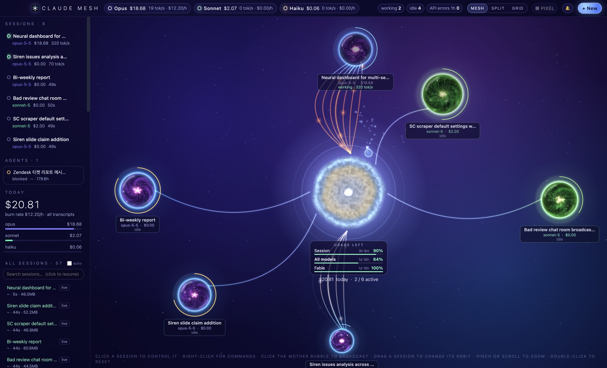
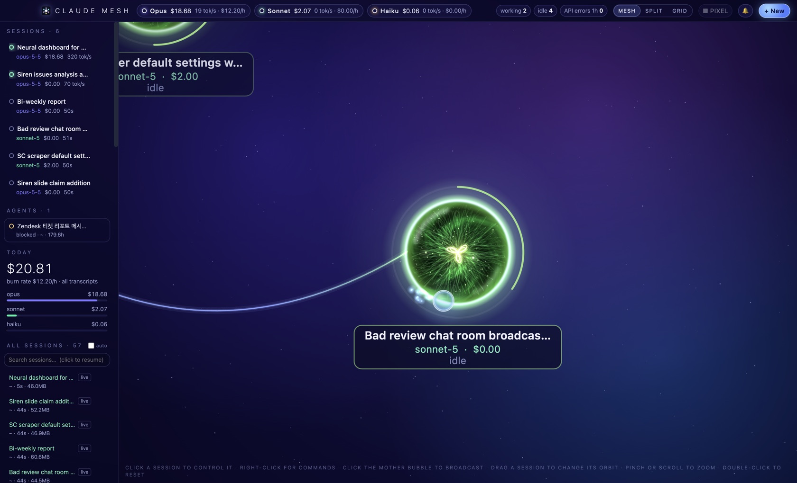
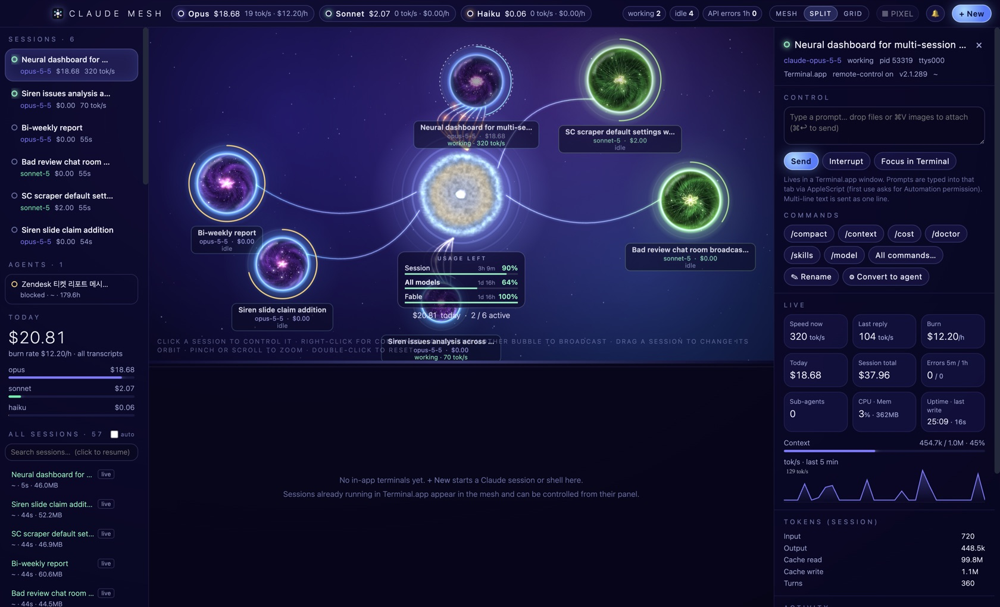
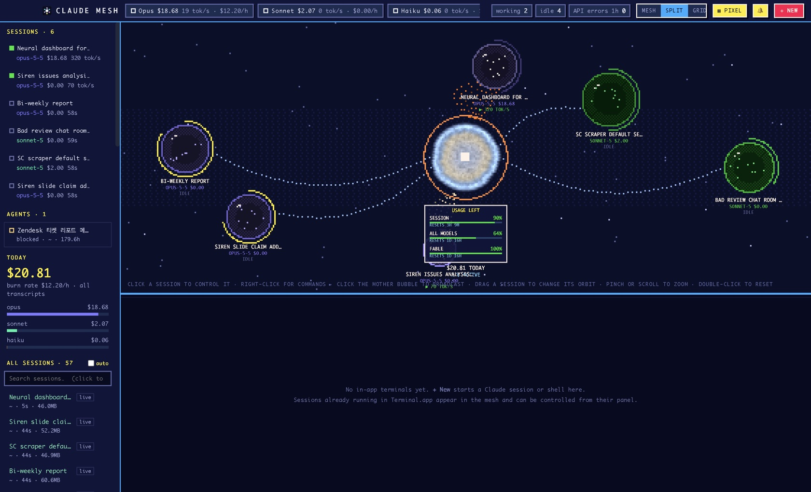

# Claude Mesh

A native macOS mission-control app for **Claude Code**. It shows every running Claude Code session as a living bubble orbiting a central "mother" star, with real-time spend, speed, health and plan-usage limits, and it can run, resume, rename and command sessions in built-in terminals.

Electron app · personal tool, separate from the Spigen automations · macOS (Apple Silicon)



| Session orb close-up | Session panel & commands | Pixel mode |
|---|---|---|
|  |  |  |

---

## What it does

| Area | Features |
|---|---|
| **Live mesh** | Each session is a bubble whose interior is a swirling nebula with sparks and a beating heart-knot. It is coloured by model: Opus violet/cyan, Sonnet green, Fable red/magenta, Haiku amber. Bubbles darken as the session spends during the day and reset at midnight. |
| **Mother bubble** | A burning star at the centre with a heat-haze ripple. Its layers age from young (blue-white) to old (red-orange) with usage: the **rim** follows the 5-hour session limit, the **body** the weekly limit, and the **core** the month. A **Usage left** card below it shows each limit and when it resets. |
| **Load strands** | Glowing curved strands tie each session to the mother, with light pulses running along them. The harder a session works (smoothed tok/s), the more strands it has (1 → 7), and the older their star colour: young blue-white when light, through gold, to red-orange under heavy load. |
| **Navigation** | Pinch or scroll to zoom (0.65×–2×). Drag empty space to pan (the map extends 40% past the window). Double-click empty space to reset the view. Every session keeps its own slow orbit; new sessions take the widest free gap, and nothing re-slots when others come, go or move. Drag a session to give it a new orbit: farther orbits turn slower, closer ones faster. Double-click a session to release it back to an automatic orbit. Clicking empty space only ripples and never pushes sessions. |
| **Stats** | Header shows per-model spend, tok/s and burn $/h, plus counts of working/idle/attention sessions and API errors. The panel shows speed now and last reply, burn, today, session total, errors, sub-agents, CPU/mem, a context gauge, a 5-minute sparkline, token breakdown, spend by model and an activity log. |
| **Control** | Send prompts, Interrupt (Esc), Focus, Kill. In-app sessions are driven through node-pty; sessions in Terminal.app via AppleScript, matched by tty. Broadcast to many sessions by clicking the mother bubble. |
| **Slash commands** | Right-click a session, or click its ⋯ menu, for all built-in commands plus your own `~/.claude` and project skills/commands. Quick chips: `/compact /context /cost /doctor /skills /model`. Typing `/` in the prompt box autocompletes. `/clear` and `/exit` ask for confirmation. |
| **All sessions** | Lists every past session, the same set `claude --resume` shows, with search. **Click to resume** in an in-app terminal with `--dangerously-skip-permissions`; the folder-trust prompt is answered automatically. An **auto** toggle also shows `claude -p` runs. |
| **Rename / agents** | Rename any session: running ones get `/rename`, others get a `custom-title` record. **Convert to agent** runs `claude --bg --resume <id>`. The **Agents** list comes from `claude agents --json`, with attach, logs and stop. |
| **Terminals** | xterm.js terminals with tabs, Split/Grid views and a resizable dock. ⌘V pastes Finder files as escaped paths and screenshots as saved PNG paths; Finder drag-drop also works. |
| **Pixel mode** | ⌘P switches to a lightweight retro renderer: low-res, 30 fps, same features. |
| **Notifications** | Optional macOS notifications when a session finishes, errors or waits for input. |

## Performance

- Rendering is GPU-accelerated 2D canvas. The governor draws at **60 fps only while you interact** (pointer, drag, zoom, pan) and at **30 fps otherwise**. It draws **nothing** while the window is hidden, minimised or occluded (background throttling plus window events), or while Grid view hides the mesh. Telemetry keeps flowing throughout.
- The backdrop (gradients and stars) is pre-rendered, so each frame is one blit plus about 45 live twinkling stars. Orb textures, the mother's star texture and glow sprites are generated once and cached. Sparks are batched into 4 fills per orb. Nothing uses `shadowBlur`.
- The header, sidebars, buttons and chips don't use `backdrop-filter`: they never overlap the canvas, so the blur was invisible but was recomputed every frame. Only cards and menus that float over the mesh keep it.
- The history list re-renders only when something visible changes.
- Measured on an M2 Pro with 6 sessions, all helper processes combined:

  | Version | Calm | Interacting |
  |---|---|---|
  | Before | ≈ 85% of a core | ≈ 85% of a core |
  | Now | ≈ 28% | ≈ 30% (60 fps) |
  | Hidden | — | ≈ 2% |

## Data sources (all local, read-only except where noted)

- `~/.claude/sessions/<pid>.json`: live sessions with name, status busy/idle, cwd and kind.
- `~/.claude/projects/<enc-cwd>/<sid>.jsonl`, plus `subagents/`: per-message model and token usage. Spend is computed at list price per token type (`PRICES` in `collector.js`). Messages repeated per content block are de-duplicated by `message.id`.
- **Plan usage**: the same request `/usage` makes (`GET api.anthropic.com/api/oauth/usage`), using the Claude Code login read from the macOS keychain at request time. The token is never stored or logged.
  - Fallback: `~/.claude/state/mesh-statusline.json`, which a one-line addition to the user's status-line script saves.
- The weekly peaks behind the monthly estimate are saved in `~/Library/Application Support/Claude Mesh/weekly-usage.json`. The history-list cache is saved in `history-cache.json` in the same folder.
- **Writes**:
  - Renaming a session that isn't running appends a `custom-title` line to its transcript, the same record `/rename` writes.
  - Dragged orbits are saved in localStorage.

## Project layout

```
main.js        Electron main: window, node-pty terminals, AppleScript control, history scan,
               rename, background agents, plan-usage fetch, telemetry loop (1 s)
collector.js   Session registry + incremental transcript tailing → spend/speed/health snapshot
preload.js     window.api bridge (contextIsolation)
renderer/
  index.html   Layout + script order
  app.js       Header, session list, detail panel, terminals, views, modals, notifications
  mesh.js      Canvas engine: camera (zoom/pan), backdrop, input, links/fx, frame loop
  mother.js    Mother star: star-ageing colour model, heat-haze rendering, usage card
  bubbles.js   Orbits (Kepler-ish, stable per session), drag-to-orbit, load strands
  organism.js  Session "living universe" bubbles (nebula, fibres, sparks, heart-knot, glass rim)
  pixel.js     Pixel-mode renderer
  commands.js  Slash-command menu, quick chips, "/" autocomplete
  history.js   All-sessions list, resume, rename, convert-to-agent, agents list
  style.css    Glass UI skin + pixel skin
build/         App icon (mkicon.js generates icon.icns)
docs/          README screenshots
install.sh     Build → sign → install to /Applications → relaunch
sync-to-repo.sh  Copy this source into the GCX repo's ClaudeMesh/ folder (working copy lives in ~/Apps/ClaudeMesh)
```

## Build & install

```bash
npm install            # Electron 44 + node-pty (allow its install script)
npx electron-rebuild -f -w node-pty
npm start              # run from source
bash install.sh        # build, sign, install to /Applications, relaunch
```

`install.sh` signs with a local self-signed identity named **"Claude Mesh Local Signing"** if it is in the login keychain. A stable signature means macOS remembers file-access permissions (and a one-time Full Disk Access grant) across rebuilds. Without the identity it falls back to ad-hoc signing.

⚠ **Reinstalling quits the app, and that ends every session running in its terminals.** Resume them with one click from **All sessions**.

## Debugging

| Env var | Effect |
|---|---|
| `MESH_DEBUG=1` | Pipe renderer console to stdout; enables `window.api.debugShot(path)` |
| `MESH_SHOT=/path.png` (+ `MESH_SHOT_DELAY=ms`, `MESH_SHOT_QUIT=1`) | Capture the window after it settles |
| `MESH_EVAL='js'` | Run JS in the renderer 3 s after load |

Notes:
- Don't run two instances at once.
- The dev window opens under the pointer, so real scrolling can change its zoom. Stub `viz.wheelZoom` in `MESH_EVAL` for zoom tests.

## Keyboard

⌘1/2/3 Mesh/Split/Grid · ⌘T new session · ⌘B broadcast · ⌘P pixel mode · ⌘4–9 switch terminal tabs
