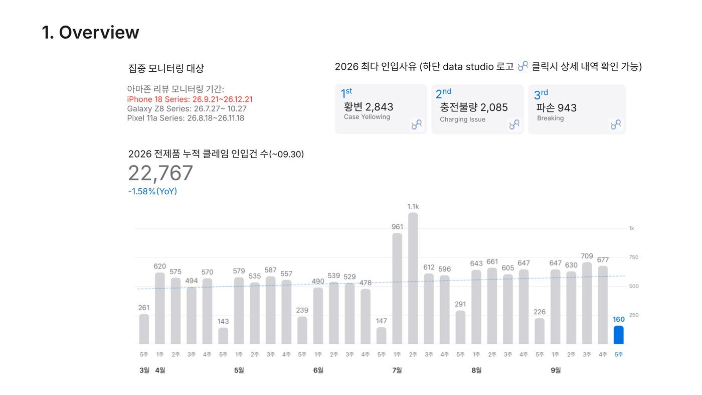

# Bi-Weekly Report (GCX Bi-weekly Report deck GAS)

Container-bound Google Apps Script for the **GCX Bi-weekly Report** Google Slides deck. It
generates the claim / bad-review card slides from the 고객사진 모음 source decks, redraws the
Overview TOP3 gauge grids (모델별 / 인입사유별) from the Zendesk `26년 전체문의` sheet and the
per-series Amazon `1-3점` sheets, adds `SIREN 등록됨` badges, and still supports the original
`{{placeholder}}` text/arc-chart updater. The companion Python tooling in `tools/` builds the
"클레임 + 배드리뷰 / 판매량 TOP 7" tables (Caspi sales) and the apple.com-style copy of the deck,
which since 2026-10-01 is the version that gets sent.

The end-to-end runbook is the `bi-weekly-builder` skill (`~/.claude/skills/bi-weekly-builder/SKILL.md`,
snapshot of v2.1 in `tools/apple_theme/SKILL_snapshot_261002.md`).

## Screenshots

*261002 Apple-style deck: cover, Overview, TOP3 gauges*

*Overview slide*

## How a period is built

Each period's deck is a **copy of the previous period's deck**, so the bound script is copied too
(new script ID every period — ask for the current deck / Apps Script URL before working on it).

1. **Edit `BW_RUN`** at the top of `Code.js` (the skill rewrites it): card window `start`/`end`,
   `sources` (series keys), `appleDeck` (ID of the `-apple` copy) and the `overview` job list
   (one entry per Overview TOP3 slide: slide objectId + `dataSource` `zendesk` | `badReview:<key>`,
   `category`, `devices`, `startDate`, `excludeReasons`). Series slides are cumulative; the
   "2026년 전제품" slide uses `startDate: 2026-01-01`; bad reviews always exclude `긍정 리뷰`.
2. **Runners** (the editor's Run dropdown defaults to the first function in the file, so the needed
   runner is moved to the top before `clasp push`):

   | Runner | What it does |
   |---|---|
   | `bwRunCards()` | Claim/review cards for `BW_RUN.start..end` into the bound deck (`_generateClaimSlides`); re-runs only add missing cards |
   | `bwRunOverview()` | Redraws every `BW_RUN.overview` slide in the bound deck, classic navy theme |
   | `bwRunOverviewApple()` | Same grids on `BW_RUN.appleDeck`, apple theme (white tiles on `#F5F5F7`) |

   Overview runs are resumable across the 6-min cap: finished slide IDs are kept in Script
   Property `bw_overview_done_<end>` / `bw_overview_apple_done_<end>`.
3. **TOP-7 tables** — `tools/rate_pipeline.py` (below).
4. **Apple copy** — `tools/apple_theme/` scripts (see its README), then send the Apple deck as
   `<yymmdd> GCX Bi-weekly Report`. Optional: share it through the tracked link of
   `../BiWeeklyViewLog`.

Each period's deck should contain only that period's cards — delete copied previous-period cards
after generating. A series with no card in the deck yet is skipped by the maker (seed it by
duplicating another family's card and retitling it).

## Deck menu (`onOpen` → **Slide Updater**)

| Menu item | Function | Notes |
|---|---|---|
| Update Slide Text | `updateSlideTextBoxes()` | Legacy placeholder updater, active slide only (see below) |
| Custom Chart Maker... | `showChartMakerSidebar()` | Sidebar from `ChartMaker.html` → `generateCustomCharts(opts)`; filters by data source (Zendesk / bad-review series), category, device, product, date range, excluded tags; fills suffixed `{{Defect_Model_Chart_<suffix>N}}` placeholders. ⚠️ `ChartMaker.html` exists locally but is not tracked in git |
| Claim / Review Slide Maker... | `showSlideMakerSidebar()` | Sidebar `SlideMaker.html` → `previewClaimSlides(opts)` / `generateClaimSlides(opts)` |
| Apply SIREN badges to existing cards | `applySirenBadges()` | Badges the archive of already-generated cards |
| Create 260618 Report / Get YoY Stats (260618) | `createReport260618()`, `getYoYStats()` | One-off for the 2026-06-18 period; kept for reference |

## Claim / Review Slide Maker

- Sources (`CLAIM_SLIDE_SOURCES`): 클레임 및 배드리뷰 고객사진 모음 decks for `glxZ8` (Galaxy Z8),
  `pixel11` (Pixel 11) and `iphone18` (iPhone 18, added 2026-10-01). Rows are picked by 작성 날짜;
  slides containing `템플릿 예시` / `기입 순서` are skipped.
- For each row, the family's last card is duplicated and filled **by position**
  (`CLAIM_CARD_FIELDS`; photo slot area `CLAIM_PHOTO_AREA`), then placed after the family's last card.
  Duplicates are detected by review link / row key, so re-runs are idempotent. Runs stop at a
  300 s budget to stay under the 6-min cap — just run again.
- ASIN from the series `1-3점` sheet (DE tab fallback); 아마존 리뷰 평점 / 갯수 from the series
  sheet's `DE` tab (blank if no score).
- Photos are re-cropped via the Slides advanced service (`replaceImage` CENTER_CROP) after
  `saveAndClose()` (`_CROP_QUEUE` / `_flushCropQueue`); Drive videos get a Drive thumbnail linked to
  the video.
- **SIREN badge**: if SKU + 인입사유 fuzzy-match a `SIREN 등록 = O` row of `SIREN_SHEET`
  (`26년 SIREN`, header row 18), a red `SIREN 등록됨` chip linked to the SIREN deck (found in Drive by
  the sheet's title column) is added.

## Overview TOP3 gauge grids

`rebuildChartGridOnSlide(slide, opts)` redraws a TOP3 grid **in place**: it deletes every
non-group element at L≥110 / T≥45 (title, sidebar and logo sit outside) and draws 2 rows × 3
half-donut cards (모델별 TOP3 → top reasons, 인입사유별 TOP3 → top products) via
`buildTopProductsDataV2` / `buildTopReasonsDataV2` and `_drawChartGrid`. Card text is uniform
(`CHART_CARD_GEOM`: count 13.5pt, title 8.5pt, legend/value 7.5pt @115%; long labels trimmed).
Visual theme comes from `CHART_THEMES.classic` (navy, Arial) or `CHART_THEMES.apple`
(white 12pt-radius tiles from `_insertRoundedTile`, Noto Sans KR, blue palette).

Data sources: Zendesk `26년 전체문의` (Category `4. Product Issue`, Device substring per series) or
`BAD_REVIEW_SOURCES` (`glxZ8`, `pixel11`, `iphone18` → each book's `1-3점` tab, columns
`모델명` / `인입사유(tag)` / `기종명`).

## Placeholder updater (`updateSlideTextBoxes`, legacy)

The original mode: replaces `{{placeholder}}` text boxes and inserts arc chart images on the
**currently active slide only** — switch to the target slide before running. The Glx26 families
below still point at the Galaxy S26 data (Glx26 Amazon book `1fpv9TEDPGR8D6QRRc0ll-WzF7sOkfxe9UNBCmdBSE9g`).
Run: select the slide → **Slide Updater → Update Slide Text**; the deck is saved and closed on completion.

### Placeholders replaced

#### General

| Placeholder | Value inserted |
|---|---|
| `{{TOTAL_INQUIRIES}}` | Total row count from `26년 전체문의` |

#### Defect_Reason family (top defect reasons)

| Placeholder | Value inserted |
|---|---|
| `{{Defect_Reason_1}}` ~ `{{Defect_Reason_5}}` | Top 5 `인입사유` values under `Category = 4. Product Issue` |
| `{{Defect_Reason_1_Count}}` ~ `{{Defect_Reason_5_Count}}` | Corresponding counts |
| `{{Defect_Reason_<keyword>}}` | Count of rows whose `인입사유` contains `<keyword>` |

#### Defect_Model family — grouped by Product Name (top-3 products → top-3 reasons each)

| Placeholder | Value inserted |
|---|---|
| `{{Defect_Model_Chart_1}}` ~ `{{Defect_Model_Chart_3}}` | Half-donut arc image (440×340 px) for top-3 defect products — **preserved on re-run** (see below) |
| `{{Defect_Model_Chart_Title_1}}` ~ `{{Defect_Model_Chart_Title_3}}` | Product name of top-N defect product |
| `{{Defect_Model_Chart_Count_1}}` ~ `{{Defect_Model_Chart_Count_3}}` | Total defect count with `건` suffix (e.g. `689건`) |
| `{{Defect_Model_Chart_Legend_1}}` ~ `{{Defect_Model_Chart_Legend_3}}` | 인입사유 names only, one per line (top 3 + 그 외) |
| `{{Defect_Model_Chart_Legend_Value_1}}` ~ `{{Defect_Model_Chart_Legend_Value_3}}` | Corresponding counts, one per line |

#### Model_Defect family — grouped by 인입사유 (top-3 reasons → top-3 products each)

| Placeholder | Value inserted |
|---|---|
| `{{Model_Defect_Chart_1}}` ~ `{{Model_Defect_Chart_3}}` | Half-donut arc image (440×340 px) for top-3 defect reasons — **preserved on re-run** |
| `{{Model_Defect_Chart_Title_1}}` ~ `{{Model_Defect_Chart_Title_3}}` | 인입사유 name of top-N defect reason |
| `{{Model_Defect_Chart_Count_1}}` ~ `{{Model_Defect_Chart_Count_3}}` | Total count with `건` suffix |
| `{{Model_Defect_Chart_Legend_1}}` ~ `{{Model_Defect_Chart_Legend_3}}` | Product names only, one per line (top 3 + 그 외) |
| `{{Model_Defect_Chart_Legend_Value_1}}` ~ `{{Model_Defect_Chart_Legend_Value_3}}` | Corresponding counts, one per line |

#### Defect_Model_Glx26 family — same as Defect_Model, filtered to `Device` contains `'Galaxy S26'`

Covers Galaxy S26, S26+, S26 Ultra, etc. (substring match on the `Device` column).

| Placeholder | Value inserted |
|---|---|
| `{{Defect_Model_Chart_Glx26_1}}` ~ `{{Defect_Model_Chart_Glx26_3}}` | Half-donut arc image for top-3 defect products (Galaxy S26 rows only) — **preserved on re-run** |
| `{{Defect_Model_Chart_Title_Glx26_1}}` ~ `{{Defect_Model_Chart_Title_Glx26_3}}` | Product name |
| `{{Defect_Model_Chart_Count_Glx26_1}}` ~ `{{Defect_Model_Chart_Count_Glx26_3}}` | Total count with `건` suffix |
| `{{Defect_Model_Chart_Legend_Glx26_1}}` ~ `{{Defect_Model_Chart_Legend_Glx26_3}}` | 인입사유 names, one per line (top 3 + 그 외) |
| `{{Defect_Model_Chart_Legend_Value_Glx26_1}}` ~ `{{Defect_Model_Chart_Legend_Value_Glx26_3}}` | Corresponding counts, one per line |

#### Model_Defect_Glx26 family — same as Model_Defect, filtered to `Device` contains `'Galaxy S26'`

| Placeholder | Value inserted |
|---|---|
| `{{Model_Defect_Chart_Glx26_1}}` ~ `{{Model_Defect_Chart_Glx26_3}}` | Half-donut arc image for top-3 defect reasons (Galaxy S26 rows only) — **preserved on re-run** |
| `{{Model_Defect_Chart_Title_Glx26_1}}` ~ `{{Model_Defect_Chart_Title_Glx26_3}}` | 인입사유 name |
| `{{Model_Defect_Chart_Count_Glx26_1}}` ~ `{{Model_Defect_Chart_Count_Glx26_3}}` | Total count with `건` suffix |
| `{{Model_Defect_Chart_Legend_Glx26_1}}` ~ `{{Model_Defect_Chart_Legend_Glx26_3}}` | Product names, one per line (top 3 + 그 외) |
| `{{Model_Defect_Chart_Legend_Value_Glx26_1}}` ~ `{{Model_Defect_Chart_Legend_Value_Glx26_3}}` | Corresponding counts, one per line |

#### AMZ_Defect_Model_Glx26 family — Glx26 Amazon `1-3점` sheet, grouped by `모델명` → top-3 reasons

Source: spreadsheet `1fpv9TEDPGR8D6QRRc0ll-WzF7sOkfxe9UNBCmdBSE9g`, sheet `1-3점`.
Columns: `모델명` (product name), `인입사유(tag)` (reason). No additional filter — sheet is already scoped to Glx26 Amazon reviews.

| Placeholder | Value inserted |
|---|---|
| `{{AMZ_Defect_Model_Chart_Glx26_1}}` ~ `{{AMZ_Defect_Model_Chart_Glx26_3}}` | Half-donut arc image for top-3 products — **preserved on re-run** |
| `{{AMZ_Defect_Model_Chart_Title_Glx26_1}}` ~ `{{AMZ_Defect_Model_Chart_Title_Glx26_3}}` | `모델명` value |
| `{{AMZ_Defect_Model_Chart_Count_Glx26_1}}` ~ `{{AMZ_Defect_Model_Chart_Count_Glx26_3}}` | Total count with `건` suffix |
| `{{AMZ_Defect_Model_Chart_Legend_Glx26_1}}` ~ `{{AMZ_Defect_Model_Chart_Legend_Glx26_3}}` | 인입사유 names, one per line (top 3 + 그 외) |
| `{{AMZ_Defect_Model_Chart_Legend_Value_Glx26_1}}` ~ `{{AMZ_Defect_Model_Chart_Legend_Value_Glx26_3}}` | Corresponding counts, one per line |

#### AMZ_Model_Defect_Glx26 family — Glx26 Amazon `1-3점` sheet, grouped by `인입사유` → top-3 products

| Placeholder | Value inserted |
|---|---|
| `{{AMZ_Model_Defect_Chart_Glx26_1}}` ~ `{{AMZ_Model_Defect_Chart_Glx26_3}}` | Half-donut arc image for top-3 reasons — **preserved on re-run** |
| `{{AMZ_Model_Defect_Chart_Title_Glx26_1}}` ~ `{{AMZ_Model_Defect_Chart_Title_Glx26_3}}` | 인입사유 name |
| `{{AMZ_Model_Defect_Chart_Count_Glx26_1}}` ~ `{{AMZ_Model_Defect_Chart_Count_Glx26_3}}` | Total count with `건` suffix |
| `{{AMZ_Model_Defect_Chart_Legend_Glx26_1}}` ~ `{{AMZ_Model_Defect_Chart_Legend_Glx26_3}}` | `모델명` values, one per line (top 3 + 그 외) |
| `{{AMZ_Model_Defect_Chart_Legend_Value_Glx26_1}}` ~ `{{AMZ_Model_Defect_Chart_Legend_Value_Glx26_3}}` | Corresponding counts, one per line |

### Chart placeholders (`{{Defect_Model_Chart_N}}` / `{{Model_Defect_Chart_N}}`)

Place a text box containing exactly `{{Defect_Model_Chart_1}}` (or `_2`, `_3`, or the
`Model_Defect_` equivalents) on a slide.
The script reads its position/size, clears its text, and inserts a 440×340 px PNG arc image
at the same position — sized to match the original text box.

**Preserve behavior**: once the placeholder text is cleared (i.e. the chart has been placed),
the script skips that slot on all subsequent runs — the image is preserved. To force a
refresh, retype `{{Defect_Model_Chart_N}}` (or `{{Model_Defect_Chart_N}}`) into the
(now empty) text box.

**Arc spec**
- Canvas: `440×340 px`
- Visible arc (half-circle): `220×110 px`, horizontally centered, `top = 45 px`
- Full circle chart area: `220×220`, `left = 110, top = 45`
- Invisible spacer half extends below the arc (y 155–265), same background color
- Shape: ∩ upward arch (`pieStartAngle: -90`, `circumference: 180°`)
- Rendered by built-in GAS `Charts` service — no external API calls
- Technique: spacer slice equal to visible data sum → forces data into exactly 180°; spacer colored `#11162d` (background)
- Colors: `#d336f4` / `#1554ff` / `#19c7f3` / `#8790b5` (slot 1–3 + 그 외)

### Legend placeholders

Use two side-by-side text boxes on the slide:

**Defect_Model family** (names = 인입사유, values = counts):

| Placeholder | Text box style | Example output |
|---|---|---|
| `{{Defect_Model_Chart_Legend_N}}` | Left-aligned | `황변` `분리/이탈` `자석탈락` `그 외` |
| `{{Defect_Model_Chart_Legend_Value_N}}` | Right-aligned | `422` `36` `16` `125` |

**Model_Defect family** (names = Product Names, values = counts):

| Placeholder | Text box style | Example output |
|---|---|---|
| `{{Model_Defect_Chart_Legend_N}}` | Left-aligned | `Galaxy S26 Ultra` `iPhone 17e` `그 외` |
| `{{Model_Defect_Chart_Legend_Value_N}}` | Right-aligned | `312` `98` `44` |

Both Legend and Legend_Value placeholders always produce the same number of lines so the
two text boxes stay in sync.

## Source data

Legacy updater: `26년 전체문의`, key columns `Category`, `인입사유`, `Product Name`, `Device`;
defect filter `Category == "4. Product Issue"`; Glx26 filter `Device` contains `"Galaxy S26"`.
All sources used by the current code:

| Spreadsheet | ID | Tab |
|---|---|---|
| Zendesk claims (`CHART_MAKER_SHEET_ID`) | `1sjcCj_P4DRD8rywkmYJhbsrzwFfgiJQuF9nIKwCiKlc` | `26년 전체문의` |
| Galaxy Z8 book | `19OhswglYMx_dxSFFDtWI1WYPWq2jONJn6RK84KITwy4` | `1-3점`, `DE`, `신제품 라인업` |
| Pixel 11 book | `12I6z_FFmDIMHa0rLanltKKFp7kI_yREQj3adkMamPgI` | `1-3점`, `DE`, `신제품 라인업` |
| iPhone 18 book | `1aYxZRm7pf5Egx6fIoAGpGg8CWzHaZ_zsBRKsvh9U1iU` | `1-3점`, `DE`, `신제품 라인업` |
| SIREN registry (`SIREN_SHEET`) | `15Jh6ZFDBIbpv4OANVtD3g4wFBJxoof9SHWDUEU3GiXI` | `26년 SIREN` (gid 1840076165, header row 18) |
| Source deck — Galaxy Z8 | `1VC5WAoiufinAPz9bPn1OrBnAef9JkDZEZxlAGF6DDho` | |
| Source deck — Pixel 11 | `1JJKzzBnm9no89mocr6Xqzwqgz8YWoiU5S44Em7gJYSc` | |
| Source deck — iPhone 18 | `1uuHcoTZxxLYlxdaHb0KFUBbI2hEPMvkOV0cL8ELU9dU` | |

## GAS project / deploy

| Field | Value |
|---|---|
| Type | Container-bound to the period's classic deck; advanced service **Slides v1** enabled, V8, `Asia/Seoul` |
| Current script (261002) | `15U2Db0iWmLAA7Z8l2FVZ5rHe8617jrufJ5Hdc9r4oHneWC_Bpl4hF7Hs` (`.clasp.json`, git-ignored) |
| Current decks (261002) | classic `12NxCxbW3z0fH1KKEVzX_uqBGH_APlkZpBWdPgET_aCk`, Apple (sent) `1quCr9Xj-pSsVXKrYuaEOq0LPILZMN2LPUwBkY1f_GFI` |
| Push | `cd Bi-Weekly && clasp push --force` (point `.clasp.json` at the new period's script first) |

No time-based triggers; everything runs from the menu or the editor. A fresh script copy needs
the user to click *Review permissions* once.

## Functions

| Function | Purpose |
|---|---|
| `bwRunCards()` / `bwRunOverview()` / `bwRunOverviewApple()` | Per-period runners driven by `BW_RUN` (see above) |
| `previewClaimSlides(opts)` / `generateClaimSlides(opts)` | Slide Maker sidebar calls: list rows per source (new vs already in deck) / create the cards. `opts = {sources, startDate, endDate, maxCount?}` |
| `applySirenBadges()` | Add `SIREN 등록됨` chips to existing cards |
| `rebuildChartGridOnSlide(slide, opts)` | In-place Overview TOP3 grid redraw |
| `insertGeneratedChartGrid(...)` / `insertGeneratedChartCard(...)` | Lower-level grid/card drawing used by the chart maker |
| `generateCustomCharts(opts)` / `getSidebarFilterOptions(dataSource)` | Custom Chart Maker sidebar backend |
| `buildTopProductsDataV2` / `buildTopReasonsDataV2` | Filtered top-N aggregations (category, devices, product substrings, date range, excluded reasons) |
| `debug*` functions | Read-only structure dumps / trial helpers used while building the Slide Maker |
| `onOpen()` | Adds the **Slide Updater** menu (see Deck menu) |
| `updateSlideTextBoxes()` | Legacy entry point — gets active slide, orchestrates all replacements and chart insertions on that slide only |
| `replaceTextOnSlide(slide, replacements)` | Iterates shapes on a single slide and applies all `{{key}} → value` substitutions in-place |
| `buildTopProductsData(sheet, rowCount, deviceFilter?)` | Computes top-3 defect products with per-reason counts; optional `deviceFilter` string restricts to rows whose `Device` col contains that text |
| `buildTopReasonsData(sheet, rowCount, deviceFilter?)` | Computes top-3 defect reasons with per-product counts; same optional `deviceFilter` |
| `buildLegendText(item)` | Returns reason names only, one per line (for `Defect_Model_Chart_Legend_N`) |
| `buildLegendValues(item)` | Returns counts only, one per line (for `Defect_Model_Chart_Legend_Value_N`) |
| `buildModelLegendText(item)` | Returns product names only, one per line (for `Model_Defect_Chart_Legend_N`) |
| `buildModelLegendValues(item)` | Returns counts only, one per line (for `Model_Defect_Chart_Legend_Value_N`) |
| `updateDefectModelCharts(slide, topProducts)` | Calls `insertChartAtPlaceholder` for each of top-3 products on the active slide |
| `updateModelDefectCharts(slide, topReasons)` | Calls `insertChartAtPlaceholder` for each of top-3 reasons on the active slide |
| `updateDefectModelChartsGlx26(slide, topProducts)` | Same as `updateDefectModelCharts` but uses `{{Defect_Model_Chart_Glx26_N}}` placeholders (Galaxy S26-filtered data) |
| `updateModelDefectChartsGlx26(slide, topReasons)` | Same as `updateModelDefectCharts` but uses `{{Model_Defect_Chart_Glx26_N}}` placeholders (Galaxy S26-filtered data) |
| `buildAmzTopProductsData(sheet, rowCount)` | Computes top-3 products by defect count from the Amazon 1-3점 sheet using `모델명` / `인입사유`; no category or device filter |
| `buildAmzTopReasonsData(sheet, rowCount)` | Computes top-3 reasons with per-product counts from the Amazon 1-3점 sheet |
| `updateDefectModelChartsAmzGlx26(slide, topProducts)` | Inserts `{{AMZ_Defect_Model_Chart_Glx26_N}}` arc charts (Amazon 1-3점 data) |
| `updateModelDefectChartsAmzGlx26(slide, topReasons)` | Inserts `{{AMZ_Model_Defect_Chart_Glx26_N}}` arc charts (Amazon 1-3점 data) |
| `insertChartAtPlaceholder(slide, placeholder, chartData, title)` | If `{{}}` placeholder text box still exists on the slide: removes prior auto-chart for that slot, inserts new PNG, clears placeholder text. If placeholder is already gone (chart preserved): no-op |
| `buildDefectModelChartBlob(data, title)` | Builds 440×340 half-donut arc PNG via GAS `Charts` service using the spacer-slice technique |
| `refreshLinkedCharts(slide)` | Refreshes any Sheets-linked charts already embedded on the active slide |
| `findPlaceholderShape(slide, placeholder)` | Returns the first Shape on a slide whose text contains the given placeholder, or `null` |
| `findPlaceholderShapes(presentation, placeholder)` | Legacy — searches all slides; kept for manual use |
| `extractKeywordPlaceholders(slide, prefix)` | Scans active slide for `{{Defect_Reason_<keyword>}}` patterns |
| `getColumnIndexByHeader(sheet, headerName)` | Looks up a column index by header name (1-based) |
| `removeOldAutoCharts(presentation)` | Utility — removes all `AUTO_Defect_Model_Chart_*` images across all slides (not called automatically; use manually to wipe all charts at once) |

## Python tooling (`tools/`)

Auth for all scripts: `~/.config/gws_shim/token.json` (Sheets / Slides / Drive). `tools/state/`
holds intermediate JSON and is git-ignored.

| Script | Purpose |
|---|---|
| `rate_pipeline.py` | TOP-7 slides. `prep --series … --start … --end …` (claims from `26년 전체문의` `4. Product Issue` EU + 1-3점 DE/FR/IT/ES/UK, top-2 인입사유 per SKU, prints the Caspi SQL) → run the SQL via the Caspi MCP and save `state/caspi_sales.json` → `aggregate --caspi …` → `slides --deck <id>` (one "Overview (<series>) 클레임 + 배드리뷰 / 판매량 TOP N" slide per series, idempotent). Optional `sheet`. Sales = Caspi `S3.AMAZON_SELLER.VAT_TRANSACTION_DATA` (Amazon EU+UK), grouped by SKU; refuses truncated query results |
| `series.json` | Monitored series config (keys must match `CLAIM_SLIDE_SOURCES` / `BAD_REVIEW_SOURCES`) + Zendesk / SIREN sheet refs |
| `repair_cards.py`, `fill_ratings.py`, `siren_badges.py` | One-off Slides-API twins of logic now in `Code.js`; keep for emergencies |
| `apple_theme/` | apple.com-style restyle of the `-apple` deck copy — see `tools/apple_theme/README.md` |
