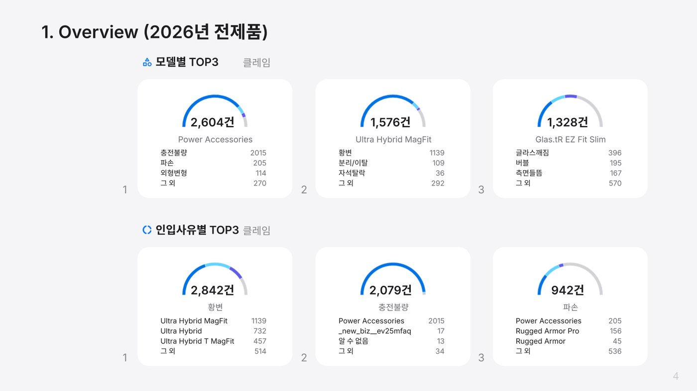

# Apple-style Bi-Weekly deck (apple.com / macOS 27 page design)

Python (Slides / Sheets / Drive API) scripts that turn a Drive copy of the finished classic
Bi-weekly deck into the apple.com-style version — `#F5F5F7` canvas, white 12pt-radius tiles,
true capsule buttons, Material Symbols icons, Apple weekly bar chart, uniform Inter / Noto Sans KR
titles, apple.com-footer Appendix and official spigen.com product shots. Since 2026-10-01 this
Apple copy is the deliverable that gets sent (as `<yymmdd> GCX Bi-weekly Report`); golden
reference = the 261002 deck `1quCr9Xj-pSsVXKrYuaEOq0LPILZMN2LPUwBkY1f_GFI`.

Full runbook: the `bi-weekly-builder` skill §7 (snapshot of v2.1: `SKILL_snapshot_261002.md`).

## Screenshots

*TOP3 gauge slide in the Apple theme*

## Config

`report.json` — per-period settings, rewritten by the skill every run: `report_code`, `report_date`,
`period`, `source_deck` (classic), `apple_deck`, `series[]` (`key`, `chip`, `title_prefix`,
`source_deck`, `sheet`, `product_url` for the Appendix nav — series are listed newest first),
`zendesk_sheet`, `siren_sheet` / `siren_gid`, `looker_url`, `apple_cover` (default `false`).
Also set `BW_RUN.appleDeck` in `../../Code.js`. `cfg.py` loads it and finds section anchor slides
by title text (no hard-coded slide IDs).

Auth: `~/.config/gws_shim/token.json` via `../rate_pipeline.creds()`. Use homebrew `python3`,
except `chart.py` / `icons_render.py` which need **`/usr/bin/python3`** (matplotlib + Pillow).
Slides write quota is 60 req/min — scripts batch and retry on 429.

## Run order

All scripts are idempotent (they delete their own `at_` / `ap3_` / `ap4_` / `lay_` / `sp_` elements
before redrawing).

| Step | Command | What it does |
|---|---|---|
| a | `python3 apple_restyle.py` | Backgrounds, removes navy sidebar chrome, Noto Sans KR, role colors, light tables |
| b | `python3 apple_cards.py` | Each claim/review card → photo tile + content tile + 5 spec tiles, blue capsule button, red SIREN capsule |
| c | `python3 apple_tables.py` | TOP-7 / SIREN tables on white tiles, hairline rows, blue "보기" links |
| d | `python3 apple_v3.py` | Appendix (apple.com footer; nav `Overview · <series…> · SPIGEN` → official device pages / spigen.com) |
| e | `python3 apple_v4.py` | SIREN header/column alignment, stat tile, outline capsule |
| f | GAS `bwRunOverviewApple()` | TOP3 gauges in `CHART_THEMES.apple` on `BW_RUN.appleDeck` |
| g | `python3 weekly_fetch.py` → `/usr/bin/python3 chart.py` | `26년 전체문의` weekly counts → `weekly.json` → `weekly_chart.png` (Apple bar chart, readable labels) |
| h | `/usr/bin/python3 icons_render.py` (only if `icons/*.png` missing) → `python3 make_assets_gas.py` | Writes temp `../../AppleAssets.js`; `clasp push`, run `aaRun`, then delete the file and push again (icons, chart swap, layout icons) |
| i | `python3 apple_layouts.py` | Apple theme (master `simple-light-2`) + 10 slide-type layouts; re-run step h afterwards |
| j | `python3 apple_type.py fix` | Uniform titles (x36 y16 18pt bold), Inter for Latin / Noto Sans KR for Hangul |
| k | `python3 spigen_images.py` | Official spigen.com product shots on cards + TOP-7 row thumbnails (base-SKU match, fallback model + series; cached in `spigen_catalog.json`). Run after b/c |
| l | `python3 align_icons.py` | Centers each icon on its label line (after any font change) |

Then render cover, index, slide 3, a gauge, a TOP-7, two cards, SIREN, Appendix and closing and fix
anything off.

Not committed (`.gitignore`): `icons/MSR.ttf` (Material Symbols Rounded, Apache-2.0, downloaded on
demand by `icons_render.py`), `weekly.json`, `weekly_chart.png`, `spigen_catalog.json`, `state/`.
