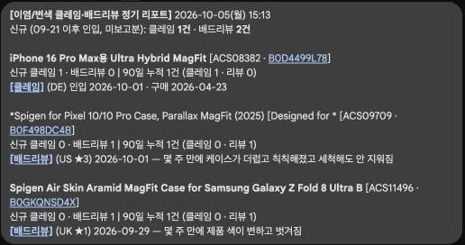

# DiscolorationReport — 이염/변색 클레임·배드리뷰 정기 리포트

Twice-weekly (Mon/Fri 10:00 KST) Google Chat report of new 이염/변색 Zendesk claims and
Amazon bad reviews, grouped by base SKU with each product's 90-day cumulative count
(🚨 flag at ≥3 = SIREN review candidate).

## Screenshots


*Report as delivered on 2026-10-05*

## How it works

- **Data**: Caspi registered queries via the headless `POST https://caspilm.spigen.com/api/data-api/run`
  endpoint (param `since_date` = today − 90 days, paged):
  - `pq_cde9dcd490cc850dad` — Zendesk tickets tagged `_case__이염/변색`, device/product names decoded
  - `pq_3cc3dd0f30778bf1f8` — Spigen ★1–3 reviews passing a multilingual keyword prefilter
- **Review classification**: local `~/.local/bin/claude -p --model sonnet`, 25 reviews per
  call (keyword prefilter alone is ~50% noise; 황변/yellowing is excluded). Each review is
  classified once and cached in `state.json` → `review_cls` — **also on `--dry-run`**.
- **"New"** = not yet reported and created within the last 14 days (catches Caspi's ~1-day
  Zendesk load lag). Grouped by 8-char base SKU; groups sorted by 90-day total.
- **Message** (`build_message()`): plain `text` with a header line (신규 클레임/배드리뷰 건수,
  SIREN 후보 수), then per SKU: label, SKU + amazon.de ASIN link, 신규/90일 누적, and one line
  per claim (Zendesk ticket link, country, 인입/구매일) and review (Amazon review link,
  marketplace, ★, Korean one-line summary). `send()` adds a cardsV2 3-column photo grid
  (`배드리뷰 고객 사진`, up to 30 `PRIMARY_PHOTO_URL`s).
- After a real send, the reported ticket/review IDs and `last_sent_date` are saved, so
  nothing is reported twice.

Tunables (top of `report.py`): `CUMULATIVE_DAYS=90`, `LOOKBACK_NEW_DAYS=14`,
`SIREN_THRESHOLD=3`, `SEND_WEEKDAYS=(0,4)`, `SEND_HOUR=10`, `CLASSIFY_BATCH=25`.

## Schedule

Since 2026-10-07 on the 24/7 GCX server crontab (`ServerBootstrap/crontab.txt`), every
30 min; `report.py` self-gates to Mon/Fri ≥10:00 and once per day, so a missed tick is
caught up on the next one. The old Mac LaunchAgent
(`com.spigen.gcx.discoloration-report.plist`) is parked in
`~/Library/LaunchAgents/disabled-moved-to-server/` — don't run both.

## Config/state (outside the repo)

- `~/.config/discoloration_report/secrets.json` (chmod 600): `caspi_api_key`, `webhook_url`
  (the user's private Chat room)
- `~/.config/discoloration_report/state.json`: `last_sent_date`, `reported_claims`,
  `reported_reviews`, `review_cls`

## Usage

```
python3 report.py             # gated scheduled run
python3 report.py --dry-run   # print the message + photo count, send nothing, don't mark reported
python3 report.py --force     # send now regardless of day/time/once-per-day gate
```
Logs: `logs/launchd.{out,err}.log`.
