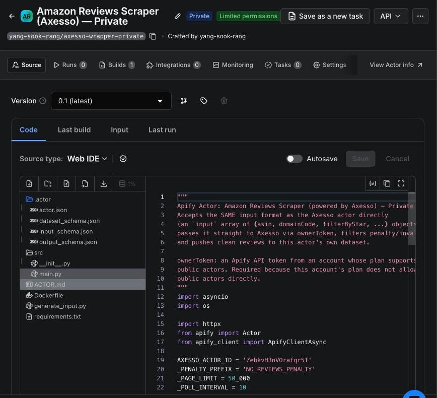

# apify-axesso-wrapper-private

Private copy of [`apify-axesso-wrapper`](../apify-axesso-wrapper/): an Apify **Python actor** that runs the Axesso Amazon Reviews scraper (`ZebkvH3nVOrafqr5T`), filters out penalty/placeholder rows, and pushes only real reviews to its own dataset. The difference is **whose account calls Axesso**: this version calls Axesso through the Apify REST API with an explicit `ownerToken` (an org-account token), for accounts whose own plan is not allowed to run public actors.

- Actor name: `axesso-wrapper-private` — title "Amazon Reviews Scraper (Axesso) — Private", version `0.1` (`.actor/actor.json`)
- `ACTOR.md` (Store-style description, identical to the public wrapper's) is the actor readme on Apify; this file is the developer note.

## Screenshots


*Actor in the Apify console*

---

## Differences from the public wrapper

| | `apify-axesso-wrapper` | `apify-axesso-wrapper-private` (this) |
|---|---|---|
| How Axesso is called | `Actor.call(...)` with the actor's own run token | `httpx` `POST /v2/acts/ZebkvH3nVOrafqr5T/runs?token=<ownerToken>`, then polls `/v2/actor-runs/{id}` every 10 s |
| Token | Implicit (actor owner) | `ownerToken` input field, falling back to the `APIFY_TOKEN` env var; fails if neither is set |
| Reading Axesso's dataset | `Actor.open_dataset(...)` | `ApifyClientAsync(token).dataset(id).list_items(...)` with the same token |
| Extra input field | — | `ownerToken` (string) |
| Requirements | `apify~=2.0`, `pydantic<2.11` | `apify>=2.0,<3.0`, `httpx`, `crawlee>=0.4,<0.7`, `pydantic<2.13` |
| `input_schema.json` | invalid JSON (trailing comma) | valid |

Everything else — input format, `strict`/`lenient` filtering, `maxBudgetUsd` → `maxTotalChargeUsd`, 50k-row paging, output dataset, `Dockerfile`, `generate_input.py` — is identical; see the public wrapper's README.

## Input

| Field | Type | Notes |
|---|---|---|
| `input` | array (required) | Axesso request objects (`asin`, `domainCode`, `filterByStar`, `maxPages`, `sortBy`, `reviewerType`, `formatType`, `mediaType`) |
| `maxBudgetUsd` | number | Optional Axesso spend cap |
| `filterMode` | `strict` \| `lenient` | Default `strict` |
| `ownerToken` | string | Apify API token of the org account that can run public actors, e.g. `<APIFY_ORG_TOKEN>` |

> ⚠️ `ownerToken` is a plain `textfield` (not marked `isSecret`), so it is stored in clear text in saved task inputs and run inputs. Set it only on private tasks, never paste a real token into docs or git, and consider adding `"isSecret": true` to the schema.

## Build & deploy

```bash
cd GAS_ReviewAutomation/Apify/apify-axesso-wrapper-private
apify login
apify push
```

Local test: `apify run --input-file input.json` (requires `ownerToken` in the input or `APIFY_TOKEN` in the environment; calls the real, billed Axesso actor).
