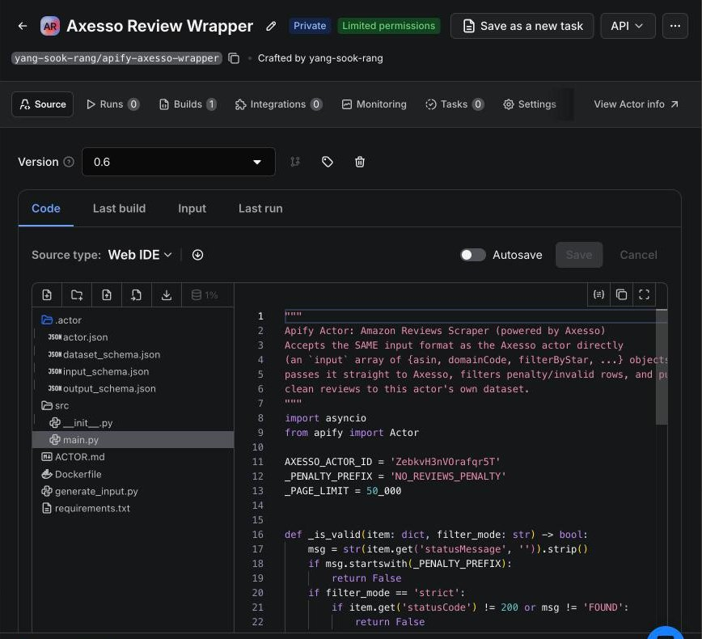

# apify-axesso-wrapper

Apify **Python actor** that wraps the Axesso Amazon Reviews scraper (Apify actor `ZebkvH3nVOrafqr5T`). It takes exactly the same `input` array Axesso does, runs Axesso, drops Axesso's placeholder / penalty rows, and pushes only real reviews into its own dataset — so downstream consumers (Sheets / GAS pollers) never see empty "NO_REVIEWS_PENALTY" rows. (Which saved Apify tasks point at this wrapper vs. at Axesso directly is configured on the Apify console, not in this repo; `MasterTrigger` also filters `*_PENALTY_n` rows itself.)

`ACTOR.md` is the public-facing actor description shown on the Apify Store page (input/output fields, example input). This README is the developer note: how the code works and how to build/deploy it.

- Actor name: `apify-axesso-wrapper` — title "Amazon Reviews Scraper (powered by Axesso)", version `0.16`, 256 MB default memory (`.actor/actor.json`)
- Private variant with an explicit token: [`../apify-axesso-wrapper-private`](../apify-axesso-wrapper-private/)

## Screenshots


*Actor in the Apify console*

---

## Files

| Path | Purpose |
|---|---|
| `src/main.py` | Actor logic |
| `.actor/actor.json` | Actor metadata; points `readme` at `ACTOR.md`, `dockerfile` at `Dockerfile` |
| `.actor/input_schema.json` | Input form (`input`, `maxBudgetUsd`, `filterMode`) |
| `.actor/dataset_schema.json` / `output_schema.json` | Dataset fields / output link (`{{links.apiDefaultDatasetUrl}}/items`) |
| `Dockerfile` | `apify/actor-python:3.11`, runs `python -m src.main` |
| `requirements.txt` | `apify~=2.0`, `apify-client~=1.0`, `pydantic`, `browserforge` |
| `generate_input.py` | Local helper that builds an `input.json` payload from an ASIN list |

## How it works (`src/main.py`)

1. Read input — either `{ "input": [...], "filterMode", "maxBudgetUsd" }` or a bare array of request objects.
2. `Actor.call('ZebkvH3nVOrafqr5T', {"input": [...], "maxTotalChargeUsd": maxBudgetUsd?})` — runs Axesso **with this actor's own run token** and waits for it.
3. If Axesso doesn't end `SUCCEEDED`, the actor fails (exit 1).
4. Reads Axesso's dataset in 50,000-row pages and filters:
   - always drops rows whose `statusMessage` starts with `NO_REVIEWS_PENALTY`
   - `strict` (default): keeps only `statusCode == 200` and `statusMessage == "FOUND"` (also drops `NOT_FOUND_PENALTY_*` etc.)
   - `lenient`: only the `NO_REVIEWS_PENALTY` filter
5. Pushes valid rows to the default dataset and sets a "Done — N review(s)…" status message.

## Input

| Field | Type | Notes |
|---|---|---|
| `input` | array (required) | Axesso request objects: `asin`, `domainCode`, `filterByStar`, `maxPages`, `sortBy`, `reviewerType`, `formatType`, `mediaType` (see `ACTOR.md`) |
| `maxBudgetUsd` | number | Optional spend cap → Axesso `maxTotalChargeUsd` |
| `filterMode` | `strict` \| `lenient` | Default `strict` |

### Generating input (`generate_input.py`)

Reads `ASIN_Glx26.txt` (one ASIN per line) and writes `input.json` = every ASIN × 8 domains (`de in com co.uk it fr es co.jp`) × star filters `one_star two_star four_star five_star` (note: no `three_star`), `sortBy recent`, `maxPages 1`. Edit `ASIN_FILE` / `STARS` at the top for other products, then paste `input.json` into the actor/task JSON input.

## Build & deploy

```bash
cd GAS_ReviewAutomation/Apify/apify-axesso-wrapper
apify login          # uses your Apify token — never commit it
apify push           # builds the actor on the Apify platform
```

Local test: `apify run --input-file input.json` (calls the real Axesso actor and is billed).

## Known issues

- `.actor/input_schema.json` currently has a **trailing comma** after the `filterMode` property, so it is invalid JSON — `apify push` / the platform will reject the input schema until it is removed. (The private variant's schema is valid.)
- `Actor.call` runs Axesso under the account that owns this actor; if that account's plan cannot run public/paid actors the call fails — that is why the `-private` variant exists.
