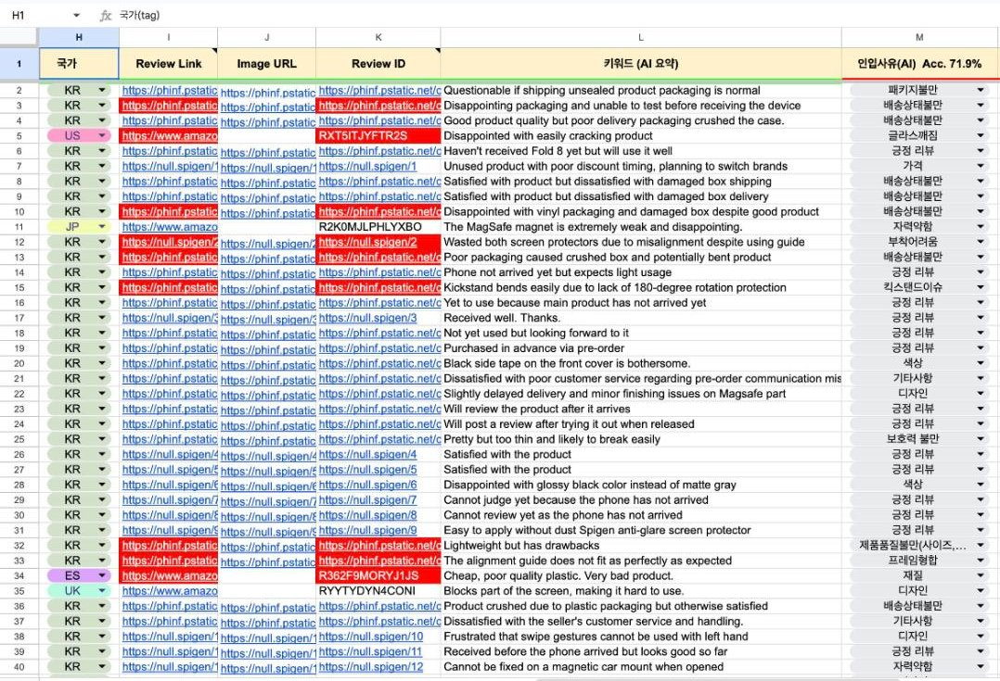

# GAS_ReviewAutomation

Google Apps Script (and Apify Actor) projects that scrape Amazon reviews/ratings via Apify + Axesso, distribute them into the per-product monitoring sheets, classify them with Gemini (`=DR()` 인입사유), and sync them with monday.com boards. Each folder is its own clasp (or `apify push`) project — see its README for config, triggers and known issues.

## Screenshots

*Daily job output: AI summary and 인입사유 columns*

## Core pipeline

| Project | Description |
|---|---|
| [MasterTrigger](MasterTrigger/) | Canonical daily job (`masterDailyJob`, 04:00 KST working days): runs all Apify review tasks and distributes rows into the product sheets with Gemini AI columns. |
| [Gemini_DR](Gemini_DR/) | Galaxy S26 (Glx26) sheet-bound `=DR()` Gemini defect / 인입사유 classifier custom function. |
| [GlxZ8_MondayToSheet](GlxZ8_MondayToSheet/) | Galaxy Z8 monday board → sheet full refresh, daily 17:00 KST. |
| [Pixel11_MondayToSheet](Pixel11_MondayToSheet/) | Pixel 11 twin of the above (board 18425190666), daily 17:00 KST. |

## Apify/ — per-product Apify triggers, monday sync, and Actors

| Project | Description |
|---|---|
| [APIFY_Axesso](Apify/APIFY_Axesso/) | Legacy/stale copy of MasterTrigger — shares its scriptId; do not `clasp push` from here. |
| [Glx26_Apify](Apify/Glx26_Apify/) | Galaxy S26 sheet: Product task poller, `=DR()`, Sheet → monday uploader (board 18399593191). |
| [GlxZ8_Apify](Apify/GlxZ8_Apify/) | Galaxy Z8 sheet: same template + `DefectDefsPatch.js` for the shared 인입사유 definitions (board 18421346787). |
| [Pixel11_Apify](Apify/Pixel11_Apify/) | Pixel 11 port of the GlxZ8 template (board 18425190666); never runtime-verified. |
| [iPhone18_Apify](Apify/iPhone18_Apify/) | iPhone 18 port of the GlxZ8 template (board 18430082360); Product task still points at the Z8 task. |
| [iPh17e_Apify](Apify/iPh17e_Apify/) | iPhone 17e per-product Apify review/product trigger. |
| [iPh17e_Monday](Apify/iPh17e_Monday/) | iPhone 17e Sheet → monday uploader (board 18419272697) + `=DR()`. |
| [Pixel10a_Apify](Apify/Pixel10a_Apify/) | Pixel 10a Product task + `=DR()`. |
| [Power_Acc_Apify](Apify/Power_Acc_Apify/) | Power Accessories review/product trigger (see known issues). |
| [SDA_Apify](Apify/SDA_Apify/) | Screen & Display Accessories review/product trigger. |
| [Auto_Acc_Apify](Apify/Auto_Acc_Apify/) | Auto Accessories trigger — same code and scriptId as SDA_Apify (unresolved conflict). |
| [유지훈P_Apify](Apify/유지훈P_Apify/) | 유지훈P daily review + product scrape, edit alert, `=DR()`. |
| [전략폰_Apify](Apify/전략폰_Apify/) | 전략폰 Product task + `FILTER_WHITE_ROWS()`; config.js still points at Glx26 (latent). |
| [SKUSales_Rating_Apify](Apify/SKUSales_Rating_Apify/) | Fills ASIN star ratings into the SKU세일즈/리뷰 sheet via the Axesso product-details actor. |
| [iPhone18Fold_Rating_Apify](Apify/iPhone18Fold_Rating_Apify/) | Same rating fill for the iPhone 18 / Fold rating sheets. |
| [apify-axesso-wrapper](Apify/apify-axesso-wrapper/) | Python Apify Actor wrapping the Axesso Amazon reviews actor with filtering + budget cap. |
| [apify-axesso-wrapper-private](Apify/apify-axesso-wrapper-private/) | Private variant calling Axesso via REST with an owner token. |
