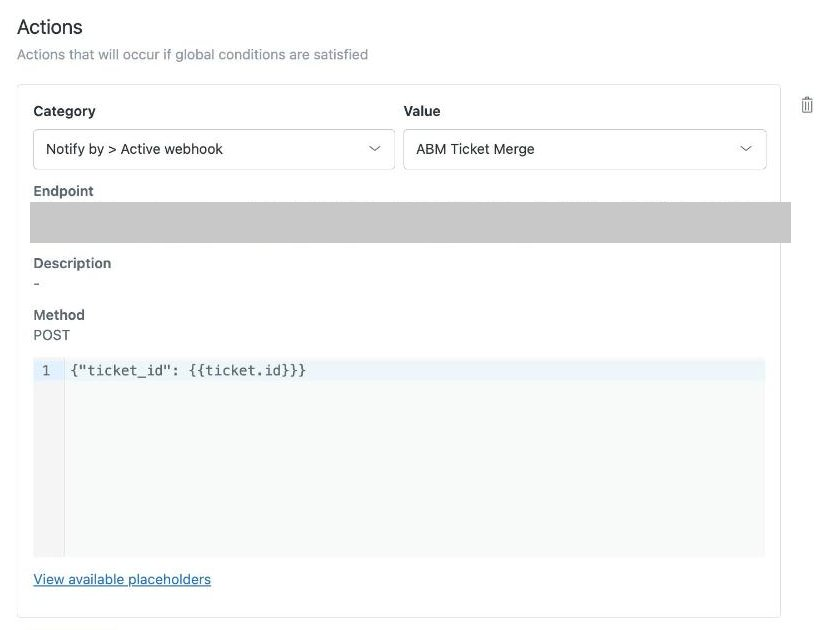

# ABM Ticket Merge

Fixes a gap in the Amazon Buyer Message (ABM) → Zendesk pipeline: Amazon sends
an unthreaded "You have received a message" notification email for **every**
ABM message, so Zendesk's mail channel creates a **new ticket per message**
instead of appending to the buyer's existing open ticket — unlike Seller
Central's own Message Center, which threads everything by `caseId` into one
conversation.

This project merges those duplicates back into a single Zendesk ticket per
buyer, so agents see one thread per ABM conversation, matching Seller Central.

**Script ID:** `1gJu9O-8MNYWVItLYsr48eym0afY1P9n8lUjSwM_p457DIisZLwOXIWAj`
**Web app URL:** `https://script.google.com/macros/s/AKfycbz2hQMj97voADUPYv6YBHzjZaLsogj1osFhFNpny5iQXtKjBJpn8P2i1pW3Af-6M89ZcA/exec`
**Current version:** deployment @40 (2026-09-21). On top of the merge itself it
posts a clean copy of the raw Amazon-template comment alongside the untouched
original (redaction was tried in v14-v18 and reverted in v19), auto-fills Order
ID / Customer Full Name / Country / Amazon Fulfillment Methods / ASIN, normalizes
the buyer's Primary Email (strips the case-specific `+uuid`), repairs Amazon's
broken "Spigen …" placeholder subjects, and runs a 30-min self-healing sweep
(relay reconciliation, failed-ticket retry, dropped-cleanup backfill). See
[Changes v25 → v40](#changes-v25--v40-2026-07-29--2026-09-21).

## Screenshots


*Zendesk trigger "ABM Ticket Merge - dedupe on create" calling the web app (endpoint secret hidden)*

## How it works

1. A Zendesk **Trigger** (`ABM Ticket Merge - dedupe on create`, id
   `60028179059225`) fires whenever a ticket is created with `current_tags`
   containing `buyer_message_amazon`.
2. It calls a Zendesk **Webhook target** (`ABM Ticket Merge`, id
   `01KXFKAQP357K470RC455Z4PZ9`), POSTing `{"ticket_id": <new ticket id>}` to
   this project's deployed web app, with `?secret=...` as a shared-secret
   query param (checked in `doPost`).
3. `Code.js`:
   - Takes a 5-minute `CacheService` claim on the ticket id (so Zendesk's own
     webhook retries can't re-run the whole pipeline concurrently), skips
     tickets that are already `closed`, then repairs a broken subject
     (`fixAbmSubjectPlaceholder_`) and normalizes the requester identity
     (`normalizeAbmRequesterIdentity_`) before anything else.
   - Looks up the new ticket's requester email.
   - Searches Zendesk for the buyer's prior `buyer_message_amazon` tickets
     that are **not closed** (`status<closed` — keeps new/open/pending/solved,
     drops only terminal `closed`), newest first.
   - **Primary selection is case-ID aware.** Amazon's buyer proxy address
     embeds the Seller Central case ID
     (`...+<uuid>@marketplace.amazon.<tld>`). The `+uuid` address is **never**
     the literal From: header — it only appears in the email's
     `original_recipients`, which Zendesk exposes only through
     `/tickets/{id}/audits.json`, so `caseIdFromTicket_` falls back to the
     first audit event (v27). A same-case primary created only seconds earlier
     is also remembered in `CacheService` for 1 h, closing the search-index
     lag gap for near-simultaneous messages. When the new ticket has one, the
     newest candidate with the **same** case ID wins (the exact key Seller
     Central threads by); a candidate with a *different* explicit case ID is
     never chosen; candidates with no resolvable case ID are a soft fallback.
     With no case ID on the new ticket, it falls back to the newest
     same-requester candidate.
   - **Re-fetches the chosen primary fresh** before mutating — Zendesk's search
     index lags live state, so a search result's `status` can be stale. If the
     fresh fetch shows it's actually `closed`, it's skipped.
   - If a usable primary is found: posts the new message as a **public comment
     on the primary** (authored as the requester, so it reads as the
     customer's follow-up), **carrying over the customer's attachments**
     (photos/PDFs — re-downloaded from the source ticket and re-uploaded, since
     Zendesk comments can't reference another ticket's attachment tokens), and
     **reopening the primary to `open` if it was `solved`** — then closes the
     new duplicate with an internal note pointing to the primary.
   - If none found: leaves the new ticket untouched — it becomes the primary
     for future messages.
   - **Idempotency guard**: an incoming ticket that's already `closed` (a
     webhook retry re-firing after this script already processed & closed it)
     is a no-op.

No persistent state/mapping is kept — each invocation searches Zendesk live.

### Reopen & merge (v3/v4) — the split-ticket fix

The original v1/v2 only merged into a **still-open** ticket and never reopened.
Because agents reply then **solve** a ticket, by the time the buyer wrote back
the prior ticket was already solved, so the merge found nothing and a fresh
unmerged ticket was created — producing the reported chains of split tickets
(e.g. JP `#1000153447 → #1000153603 → #1000153740`, all solved between
messages). v3 broadened selection to include solved tickets and reopens them;
v4 added the fresh re-fetch so the reopen decision uses true (not
index-lagged) status. Verified live end-to-end: a solved primary with a fake
buyer's second message auto-reopened to `open` and now holds both messages,
duplicate auto-closed.

**Remaining limit:** a `closed` (terminal) prior ticket cannot be reopened or
commented on in Zendesk, so if the buyer's previous ticket was already fully
*closed* (not just solved) when they write again, a new primary is started.
Solved is reopenable; closed is not.

## Inbound ABM message cleanup (v10)

Amazon's "You have received a message" notification email buries the buyer's
own typed text inside a full marketing/legal HTML template (logo, order
table, survey buttons, footer copyright, `commMgrTok`/`SPC-xxAmazon-...`
tracking IDs) — the resulting ticket comment looks nothing like a normal
claim, even though Zendesk's own inbound mail parsing already attaches the
buyer's real photos/PDFs correctly (verified — no fix needed there).

Investigated live 2026-07-21 by diffing the raw `html_body` of real ABM
tickets across JP/EN/DE: every sample wraps the buyer's own text in exactly
one `<pre>` block with an identical inline style regardless of marketplace/
language — only the surrounding template strings are translated, this
wrapper isn't. That makes it a reliable, locale-agnostic extraction anchor,
so this runs entirely server-side — no Seller Central lookup, no live agent
browser session needed.

Zendesk's Comments API has no way to *replace* a comment's visible text, so
this **adds a separate clean public comment** (customer's real message +
attachments re-hosted onto it, authored as the requester) right after any
raw-template comment is detected. **The raw original is left fully intact —
by design, both the raw Amazon-template comment and the clean copy are
visible in the ticket.** Idempotency (safe to re-run/backfill — each source
comment gets at most one clean copy) is tracked via an `abm_cleaned_{id}`
tag added to the ticket, not visible text.

**v14-v18 also redacted the raw original's text** via the comment "redact"
endpoint (permanent, blanks matched substrings with block characters) so
agents would only ever see the clean copy. **Reverted in v19** (2026-07-23):
Zendesk's own *native* "merge tickets" feature (an agent manually merging a
duplicate ABM ticket via the Zendesk UI — unrelated to this project's own
auto-merge) quotes the merged ticket's last comment by its *currently
stored* text — on a ticket whose raw comment had already been redacted, the
merge-quote system note showed the redacted block-character garbage instead
of the real message. Redaction turned out to be permanent/global, not
scoped to this feature's own view of the comment, so it was reverted.
**Comments redacted while v14-v18 was live (~2026-07-22 08:00 through
2026-07-23) cannot be restored** — Zendesk redaction has no undo via the
API. That window was under a day, so the affected set is small.

**Auto-fills Order ID / Customer Full Name / Country / Amazon Fulfillment
Methods / ASIN** on the ticket from the same order-lookup GCX Reply's own
Auto-Fill button uses (`GCXReply_GAS`'s `?orderId=` endpoint) — only ever
fills fields that are currently empty, never overwrites an agent's or
earlier run's value. **Order ID / Country / Fulfillment require a resolved
order** (extracted from `ticket.description`, then looked up via SP-API) —
but **Customer Full Name and ASIN fill even for order-less ABM tickets**
(e.g. a pre-purchase compatibility question with no Order ID anywhere in
the message, confirmed live on #1000154672): Customer Full Name falls back
to the ticket requester's from-name, and ASIN is regex-extracted directly
from the raw ABM email regardless of whether the message concerns an actual
order. (v18 originally gated ALL fields behind a resolved order, including
these two, which never needed one — fixed in v20.)

Runs automatically from both existing webhook code paths:
- `handleNewAbmTicket_`'s `left_as_primary` branch (a ticket's own first,
  creation-time comment).
- Right after `mergeNewTicketIntoPrimary_` (a merged follow-up posted onto an
  existing primary carries the same raw template).

**Manual backfill** (tickets created before this existed, or any ticket the
live path missed) — from the Apps Script editor: `testCleanupOnTicket(ticketId)`.
Remotely via the same secret-guarded webhook:
```bash
curl -X POST "$WEB_APP_URL?secret=$WEBHOOK_SECRET" \
  -H "Content-Type: application/json" \
  -d '{"action":"cleanupTicket","ticketId":1000154136}'
```
(GAS's own 302 redirect on this webapp's POST response doesn't resolve
cleanly via `curl -L`/`urllib` — a known quirk, not a failure; `doPost`
already executed server-side by the time the redirect returns. Verify by
checking the ticket in Zendesk directly rather than trusting the curl output.)

Verified end-to-end (2026-07-21) against real production data: backfilled
tickets #1000153609/623/627/636 (14 real historical inbound messages across
JP/EN, including one with an embedded link) — 100% correct extraction, zero
duplicates on re-run. Attachment re-hosting verified separately with a real
JPEG posted as a synthetic raw-template comment on #1000153636 — the new
clean comment carried the exact same file (byte-identical size), original
untouched.

## Buyer Primary Email normalization (v24)

Amazon's ABM buyer-proxy address is unique **per case** (the `+<uuid>` segment
is the Seller Central case id), but the local part before the `+` is stable
per real buyer on a marketplace. Zendesk creates a brand-new end-user from the
exact From-address the first time it sees it — so every new case spawned a
**separate** end-user whose Primary Email still carried the `+uuid` segment,
fragmenting the same real buyer across multiple Zendesk profiles. Since
clicking a customer's name in Zendesk lists tickets by end-user (not by real
buyer), agents only ever saw one case's ticket, never the buyer's full history
across orders — confirmed live: ticket `#1000132589`'s Primary Email was
already correct (bare address, no case suffix at all), while ticket
`#1000155203` (same real buyer) was a completely different end-user whose
Primary Email carried `+bb1d2d98-...`.

`normalizeAbmRequesterIdentity_` runs at the top of `handleNewAbmTicket_` for
every new ABM ticket, before the requester email is used for anything else:
strips the `+uuid` down to the base address, then either
- **merges** this ticket's just-auto-created end-user into an existing
  end-user that already has that base address (all of this ticket's history
  moves onto the one canonical profile), or
- if no such end-user exists yet, **adds the base address as a new identity
  and makes it primary** (first time this buyer is seen — becomes their
  canonical profile for every future case).

The non-primary `+uuid` identity is left alone either way. Best-effort/
non-fatal — any failure (e.g. a rare race between two near-simultaneous new
cases from the same buyer) is caught and logged, never blocks the rest of
that ticket's merge/cleanup/auto-fill.

**Manual backfill** (tickets created before this existed) — from the editor:
`testNormalizeIdentityOnTicket(ticketId)`. Remotely via the same
secret-guarded webhook:
```bash
curl -X POST "$WEB_APP_URL?secret=$WEBHOOK_SECRET" \
  -H "Content-Type: application/json" \
  -d '{"action":"normalizeIdentity","ticketId":1000155203}'
```

Verified live end-to-end on the exact two tickets above: `#1000155203`'s
end-user merged into `#1000132589`'s (`bm11jdhs75yyts4@marketplace.amazon.com.be`,
buyer "Selena") — both tickets now resolve to the same `requester_id`.

## Scheduled self-healing sweep (every 30 min)

One time-based trigger, `reconcileAbmRelays_` (every 30 min — install once with
`setupReconcileTrigger()` from the editor, or the `setupTrigger` webhook
action), runs three independent passes. Each is best-effort and a failure in
one never blocks the others:

| Pass | What it does |
|------|--------------|
| `reconcileAbmRelays_` | Safety net for GCX Reply's outgoing Seller Central relay. Scans ABM tickets updated in the last **1 h** (was 6 h until v37), finds each ticket's latest public agent reply, and if `ABM_Relay_Log` (owned by `GCXReply_GAS`) has no matching row for it — checked per ticket via `?action=abmRelayStatus`, by CommentId or normalized text — queues a `pending` row via `logAbmRelay`. It never sends anything itself; an agent browser running GCX Reply with a live SC session claims and delivers the row. Replies younger than 10 min are skipped so the live relay gets first go (fixed a race that double-sent replies). Guarded by a non-blocking script lock, so an overlapping run exits with `{skipped:'already_running'}` (v38). |
| `reconcileFailedAbmProcessing_` | Retries `handleNewAbmTicket_` on every ticket tagged `abm_auto_process_failed` (see below); on success removes the tag and leaves an internal note `자동 병합/정리 재처리 성공`. |
| `reconcileAbmCleanups_` | Re-runs `cleanupExistingAbmTicket_` on ABM tickets updated in the last hour. Catches raw comments whose clean copy was never posted because a burst of near-simultaneous messages lost the cleanup lock (v40). Already-cleaned comments are a no-op. |

`runReconcileNow()` runs the relay pass by hand with a 24 h lookback.

### Failure tagging (v33)

`doPost` always returns HTTP 200 (Apps Script can't return anything else), so
Zendesk never retries on its own. When `handleNewAbmTicket_` throws (e.g. the
account-wide UrlFetchApp daily quota runs out), the ticket gets the tag
`abm_auto_process_failed` plus an internal note
`자동 병합/정리 처리 실패 (재시도 필요): <error>`. The ticket can then be found with
a saved view, and the 30-min sweep picks it up.

## Subject placeholder repair (v33)

Amazon's own notification sometimes ships a broken subject: our seller account
name (`Spigen Japan`, `Spigen EU`, …) where the buyer's name should be, and the
order suffix missing. `fixAbmSubjectPlaceholder_` detects any `Spigen <word>`
placeholder and swaps in the buyer's real from-name. It rebuilds the order
suffix only for the two templates seen live so far (JP `…に関するお問い合わせ` +
`(注文: …)`, EN `…enquiry from Amazon customer …` + ` (Order: …)`). Subjects in
other locales are left alone rather than guessed. Backfill:
`testFixAbmSubjectOnTicket(ticketId)` or the `fixSubject` webhook action.

## Changes v25 → v40 (2026-07-29 → 2026-09-21)

Version numbers are the deployment versions given in commit messages. Rows
without one are listed by commit date.

| Version / date | Change |
|----------------|--------|
| v25 (07-29) | Cleanup now matches buyer comments by role, not `author_id`. After an identity merge, the original comment kept the old author id and was skipped. |
| 07-29 | Backfill cleanup reopens solved/pending/hold tickets when it posts a buyer comment, the same way the live merge does. Relay dedup checks the ticket's full relay history via `abmRelayStatus` instead of the 200 newest log rows. Using the 200-row window re-sent an already-delivered reply 10 days later. |
| 07-30 | Relay reconciliation waits ≥10 min after a reply before acting, which closes a race with the live browser relay that caused double sends. |
| v27 (07-30) | Case ID is read from the first audit's `original_recipients` (the `+uuid` is never in From:). Relay reconciliation went from resolving 0 case IDs to resolving all of them. |
| v28 (07-30) | `zdFetch_` retries transient `Address unavailable` UrlFetchApp failures (3 attempts). |
| 08-12 | Fixed a retry storm: a 5-min claim guard in `handleNewAbmTicket_` and a 1 h case-ID → primary cache in `findPrimaryTicket_`. Zendesk's retries had been re-running the whole pipeline, which broke dedup for many customers. |
| v33 (08-19) | Subject placeholder repair, broadened from `Spigen Japan` only to any `Spigen <word>` with the JP/EN templates. Tickets that fail are tagged `abm_auto_process_failed`. |
| v34 (08-19) | `reconcileFailedAbmProcessing_` added to the 30-min sweep. `zdFetch_` fails fast on daily-quota-exhausted errors instead of burning its retries. |
| v37 (08-19) | Clock-triggered runs had silently used a 6 h lookback (the trigger passes an event object, not a number). Default is now 1 h, which cut runs from ~265 s to ~25 s and was the main source of the UrlFetchApp quota exhaustion. |
| v38 (08-19) | Non-blocking `LockService` guard on `reconcileAbmRelays_`. |
| v39 (08-19) | `gcxGet_`/`gcxPost_` (calls into GCXReply_GAS) retry 3× with backoff on Google's HTML error page (that project's concurrency limit). |
| v40 (09-21) | `reconcileAbmCleanups_` backfills clean copies dropped by the cleanup lock race. A late backfill posts with today's timestamp, so GCX Reply's adjacent-pair collapse won't fold an old stuck comment. |

## Webhook actions

Every request must carry `?secret=<WEBHOOK_SECRET>` (the shared secret is in
`Code.js`; it is not reproduced here). Body is JSON:

| Body | Effect |
|------|--------|
| `{"ticket_id": N}` | Normal path, sent by the Zendesk trigger |
| `{"action":"cleanupTicket","ticketId":N}` | Post missing clean copies for a ticket |
| `{"action":"normalizeIdentity","ticketId":N}` | Strip `+uuid` from the requester's Primary Email / merge end-users |
| `{"action":"fixSubject","ticketId":N}` | Repair a `Spigen …` placeholder subject |
| `{"action":"reconcile","lookbackHours":H}` | Run the relay reconciliation now (default 1 h) |
| `{"action":"setupTrigger"}` | Install the 30-min sweep trigger if missing |

Editor-only runners: `testMergeOnTicket`, `testCleanupOnTicket`,
`testNormalizeIdentityOnTicket`, `testFixAbmSubjectOnTicket`, `runReconcileNow`,
`setupReconcileTrigger`.

## Configuration

There are **no Script Properties**. The Zendesk agent email/API token,
subdomain (`spigenhelp`), webhook shared secret, and the GCXReply_GAS web-app
URL (`GCX_GAS_URL`) are constants at the top of `Code.js`. Zendesk custom field
ids used for auto-fill: Order ID `360021934132`, Customer Full Name
`360021999951`, Country `4513936822297`, Fulfillment `900002781823`, ASIN
`360021934312`. Never copy the token or secret into docs. Moving them to Script
Properties is an open to-do.

## Files

| File | Purpose |
|------|---------|
| `Code.js` | `doPost` webhook receiver, merge / cleanup / auto-fill / identity / subject logic, 30-min reconciliation sweep |
| `appsscript.json` | GAS manifest (web app, `ANYONE_ANONYMOUS` / `USER_DEPLOYING`) |
| `setup_zendesk.sh` | One-time script that created the Zendesk webhook + trigger (kept for reference/rebuild, not meant to be re-run — it would create duplicates). It contains the live credentials inline, so treat it like `Code.js` and never paste it anywhere. |

## Redeployment workflow (after any Code.js edit)

The Zendesk webhook calls a **pinned** deployment. `clasp push` alone only
updates `@HEAD`, and the live webhook keeps running the old version until the
deployment is moved to a new version:

```bash
cd ~/Desktop/GCX/GAS_Zendesk/ABM_TicketMerge
clasp push --force
clasp deploy -i AKfycbz2hQMj97voADUPYv6YBHzjZaLsogj1osFhFNpny5iQXtKjBJpn8P2i1pW3Af-6M89ZcA -d "vNN: <what changed>"
clasp deployments   # confirm the deployment's @version number moved forward
```

(The REST-API equivalent: `POST /v1/projects/{scriptId}/versions` and then
`PUT …/deployments/{deploymentId}`, using your own clasp OAuth token. The
`clasp deploy -i` one-liner does the same thing.)

## Rollback

To fully disable: delete the trigger and webhook via Zendesk Admin (or
`DELETE /api/v2/triggers/60028179059225.json` and
`DELETE /api/v2/webhooks/01KXFKAQP357K470RC455Z4PZ9.json`). Zendesk will go
back to creating one ticket per ABM message, same as before.

## Known limitations

- A **closed** (terminal) prior ticket can't be reopened or commented on, so a
  buyer writing again after their thread is fully closed starts a new primary.
  Solved/pending/open tickets are reopened and merged.
- The relay reconciliation only **queues** missed replies. Delivery still needs
  at least one agent browser running an up-to-date GCX Reply with a live Seller
  Central session.
- Subject repair rebuilds the order suffix only for the JP and EN templates.
- A clean copy that is backfilled late lands at the end of the thread and
  won't be collapsed next to its raw original by GCX Reply.
- The 30-min trigger has been observed firing far more often than its
  schedule (cause unresolved). The script lock makes the extra runs harmless.
