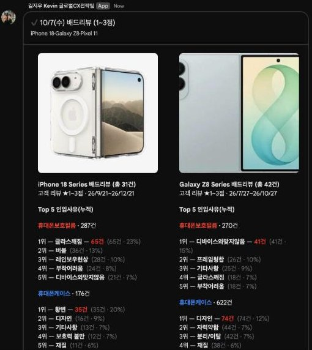
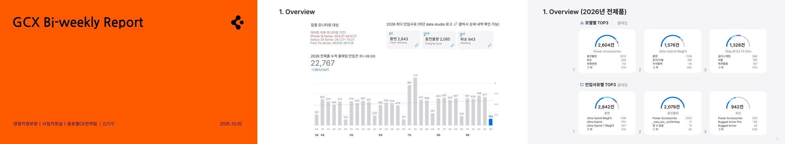

# spigen-gcx-automation

Internal automation scripts for the Spigen GCX (Global Customer Experience) team — Amazon review monitoring, Seller Central scraping, MCF order tracking, daily reporting, and CS workflow tooling.

Remotes: `origin` pushes to both `codingintheusa0402/spigen-gcx-automation` and `spigenHQ/HQ_GCX`; `gcx-sync.sh` (`gcx-sync` / `gcx-sync push`) fetches, merges and pushes all remotes. Every project folder below has its own README; this file is the index.

## Screenshots


*BadReview daily carousel*


*Bi-Weekly deck*

---

## Repository structure

Projects are grouped into category folders. Within each folder, projects sit flat (no further nesting) except `Apify/`, which groups the per-product Apify triggers together with the Apify Actor code they call.

```
spigen-gcx-automation/
│
├── Scrapers/                            # Python — scrapers & sheet pipelines (index: Scrapers/README.md)
│   ├── SC_Review_Scraper/               # Playwright scraper for Amazon Seller Central reviews → SC_{yymmdd} tab
│   ├── SC_Master_Propagate/             # SC_/CaspiLM_ tab → master SC sheet → 8 product monitoring books + Chat card
│   ├── Zendesk_Inquiry_Sync/            # Caspi Solved tickets → '26년 전체문의' sheet, scheduled (skill zendesk-inquiry-sync)
│   ├── amazon_dp_scraper/               # Amazon /dp/ product detail scraper (Playwright, async)
│   └── amazon_child_asin_scraper/       # Amazon parent→child ASIN resolver + rating/review scraper
│
├── GAS_ReviewAutomation/                # GAS — review scraping & distribution
│   ├── MasterTrigger/                   # Daily review distribution job (all products)
│   ├── Gemini_DR/                       # Galaxy S26 — Gemini-powered =DR() defect classifier
│   ├── GlxZ8_MondayToSheet/             # Galaxy Z8 — Monday board → Sheet (full refresh, daily 17:00 KST)
│   ├── Pixel11_MondayToSheet/           # Pixel 11 — same as above, board 18425190666
│   └── Apify/
│       ├── APIFY_Axesso/                # Legacy master Apify/Axesso review scrape + sheet distribution
│       ├── Glx26_Apify/                 # Galaxy S26 Apify trigger + Monday.com board sync
│       ├── GlxZ8_Apify/                 # Galaxy Z Fold8/Flip8/Fold8 Ultra Apify trigger + Monday sync
│       ├── Pixel11_Apify/               # Pixel 11 Apify product run + Monday upload (board 18425190666) + DR()
│       ├── iPhone18_Apify/              # iPhone 18 Apify product run + Monday upload (board 18430082360) + DR()
│       ├── Auto_Acc_Apify/              # Auto Accessories per-product Apify trigger
│       ├── Pixel10a_Apify/              # Pixel 10a per-product Apify trigger
│       ├── Power_Acc_Apify/             # Power Accessories per-product Apify trigger
│       ├── SDA_Apify/                   # Screen & Display Accessories per-product Apify trigger
│       ├── iPh17e_Apify/                # iPhone 17e per-product Apify trigger
│       ├── iPh17e_Monday/               # iPhone 17e Monday.com board sync (S26-pattern port)
│       ├── 유지훈P_Apify/                # 유지훈P per-product Apify trigger
│       ├── 전략폰_Apify/                 # 전략폰 per-product Apify trigger (config.js still points at Glx26)
│       ├── SKUSales_Rating_Apify/       # Weekly Amazon.de rating → SKU세일즈/리뷰 sheet
│       ├── iPhone18Fold_Rating_Apify/   # Weekday Amazon.de rating → 4 device sheets
│       ├── AmazonDE_RatingScraper_README.md  # Combined doc for the two rating projects
│       ├── apify-axesso-wrapper/        # Apify Actor wrapper around Axesso API
│       ├── apify-axesso-wrapper-private/ # Private variant of the Axesso wrapper Actor
│       └── apify-amazon-dp-scraper/     # (gitignored — its own separate repo) Apify Actor for /dp/ scraping
│
├── GAS_Operations/                      # GAS — operations & reporting
│   ├── MCF_Tracking/                    # MCF order tracking, SP-API fee/tracking lookup, daily Chat alert
│   ├── CX_Dashboard/                    # SP-API data dashboard (orders, sales, inventory, feedback)
│   ├── Bi-Weekly/                       # Bi-weekly CX report Slides builder (+ tools/apple_theme Apple-style deck)
│   ├── BiWeeklyViewLog/                 # Tracked-link web app logging who opened the Bi-Weekly deck
│   ├── SheetMirror/                     # Chunk-copy `26년 전체문의` to a read-only dashboard sheet
│   ├── TCTChatLog_GCX/                  # Lazada/Shopee Esc T2 alerts + daily close report to Google Chat
│   ├── TicketDailyReport/               # Zendesk daily ticket report with charts sent to Google Chat
│   ├── TriggerAlert/                    # Monday.com board → Google Sheets sync
│   ├── KPI_Report/                      # Populates KPI result cells on the team's KPI spreadsheet
│   ├── Monday_CX_Board/                 # Generic Monday.com board ↔ Google Sheet sync (modeless UI dialog)
│   ├── ASIN_Master_MondaySync/          # Monday.com board sync + ABM_Relay_Log retention cleanup
│   ├── BadReview_ChatReport/            # iPhone 18 / Galaxy Z8 / Pixel 11 배드리뷰(1~3점) carousel card + broadcast
│   ├── TicketReporterCard/              # Interactive Chat app — TCK report → internal note/thread-reply workflow
│   ├── CaspiSalesBackfill/              # 판매량(EU) backfill for iPhone18/Pixel11/GlxZ8 sheets from Caspi
│   ├── DiscolorationReport/             # Mon/Fri 10AM 이염/변색 claim+bad-review Chat report from Caspi
│   └── generate_kpi_report.py           # One-off: builds the H1 2026 GCX KPI report .docx
│
├── GAS_Zendesk/                         # GAS — Zendesk / CS ticketing operations
│   ├── ABM_TicketMerge/                 # Merges duplicate Amazon Buyer Message tickets + inbound cleanup
│   ├── PurchaseDate_Sync/               # Syncs Zendesk's custom Purchase Date field to a Monday.com board
│   └── GCXReply_GAS/                    # GCX Reply's SP-API/Sheet-lookup backend + versioned script archive
│
├── Browser_Extensions/                  # Userscripts & extensions
│   ├── tampermonkey_scripts/            # GCX Reply, MCF Autofill (EU + JP), Invoice Automation, GChat Reply Suggest
│   ├── gcx-reply-extension/             # WIP native Chrome extension (MV3) port of GCX Reply (not committed yet)
│   └── gchat_reply_suggest_server.py    # Local claude-CLI backend for GChat Reply Suggest.user.js
│
├── Zendesk_Themes/                      # Zendesk Guide Help Center theme exports (version control mirror)
│   ├── sq2gcx_AmazonHelpcenter/         # Amazon EU claim-form Help Center theme
│   └── spigen-eu_ShopifyHelpcenter/     # Shopify EU claim-form Help Center theme
│
├── ClaudeMesh/                          # GCX Mesh — Electron Mac app: live mission control for Claude Code sessions
│
├── ServerBootstrap/                     # 24/7 Windows/WSL2 server setup kit, crontab, job catalogs for GCX Mesh
│
├── reference/                           # Reference texts (published AI-assistant system prompts, by vendor)
├── usage-monitor-for-claude/            # Embedded third-party git repo (gitlink, no .gitmodules)
├── README_GCX.md                        # ABM_Relay_Log 에러 핸들링 가이드 (Korean CS guide, see below)
└── *.py / *.csv / *.json (root)         # One-off investigation scripts & data dumps (see below)
```

---

## Projects

Category indexes: [Scrapers](Scrapers/README.md) · [GAS_ReviewAutomation](GAS_ReviewAutomation/README.md) · [GAS_Operations](GAS_Operations/README.md) · [GAS_Zendesk](GAS_Zendesk/README.md) · [Browser_Extensions](Browser_Extensions/README.md) · [Zendesk_Themes](Zendesk_Themes/README.md) · [ServerBootstrap](ServerBootstrap/README.md) · [ClaudeMesh](ClaudeMesh/README.md)

### Python scrapers

| Project | Description | README |
|---------|-------------|--------|
| [Scrapers/SC_Review_Scraper](Scrapers/SC_Review_Scraper/) | Scrapes Amazon Seller Central reviews across US/EU/JP/IN with Playwright. Parallel by top-level domain; EU countries (DE→IT→FR→ES→UK) scrape sequentially on one shared tab. Enriches reviews with reviewer image URLs and Order IDs, then appends them (deduped by Review ID) to the `SC_{yymmdd}` tab of the source review sheet. Also packaged as an Apify Actor. | [README](Scrapers/SC_Review_Scraper/README.md) |
| [Scrapers/SC_Master_Propagate](Scrapers/SC_Master_Propagate/) | `propagate.py` (skill `sc-review-propagate`): funnels a new `SC_yymmdd` / `CaspiLM_yymmdd` tab into the master `SC` sheet, pastes new rows into the 8 product monitoring books via the `<Product> finalize` filter views (`=ai()`, `=dr()`, Update 날짜 restyle), refreshes `tem`, deletes older dated tabs and posts the "Bad Review Monitoring Completed" cardsV2 card. Dry-run unless `--commit`. | [README](Scrapers/SC_Master_Propagate/README.md) |
| [Scrapers/Zendesk_Inquiry_Sync](Scrapers/Zendesk_Inquiry_Sync/) | `sync.py` (skill `zendesk-inquiry-sync`): appends new Solved/Closed Zendesk tickets from Caspi to `26년 전체문의` (A:AD, dedupe by Ticket ID, formulas AE~ extended) on a per-user launchd / Windows Task Scheduler schedule, with an optional Chat notice. | [README](Scrapers/Zendesk_Inquiry_Sync/README.md) |
| [Scrapers/amazon_dp_scraper](Scrapers/amazon_dp_scraper/) | Async Playwright scraper for Amazon `/dp/` pages — rating, review count, title, spec table. Up to 8 domains simultaneously, dual-sheet Excel output (English + local-language). | [README](Scrapers/amazon_dp_scraper/README.md) |
| [Scrapers/amazon_child_asin_scraper](Scrapers/amazon_child_asin_scraper/) | Selenium scraper that resolves parent ASINs into child variants and extracts per-child rating/review counts. Detects shared variation review pools. | [README](Scrapers/amazon_child_asin_scraper/README.md) |

### Google Apps Script — Review automation

| Project | Product | Description | README |
|---------|---------|-------------|--------|
| [GAS_ReviewAutomation/MasterTrigger](GAS_ReviewAutomation/MasterTrigger/) | All | Daily job that reads the `"finalize"` filter view from each product's source sheet and distributes new reviews into destination spreadsheets. Handles dedup, `=dr()` formula injection, and `tem` sheet refresh. | [README](GAS_ReviewAutomation/MasterTrigger/README.md) |
| [GAS_ReviewAutomation/Gemini_DR](GAS_ReviewAutomation/Gemini_DR/) | Galaxy S26 | Gemini-powered `=DR()` custom Sheets formula that classifies review text into a defect/issue label, bound to the Galaxy S26 review spreadsheet. | [README](GAS_ReviewAutomation/Gemini_DR/README.md) |
| [GAS_ReviewAutomation/GlxZ8_MondayToSheet](GAS_ReviewAutomation/GlxZ8_MondayToSheet/) | Galaxy Z8 | Daily (17:00 KST) full-refresh sync — replaces the sheet with every item on the Galaxy Z8 Case+CP Monday board (feeds the Z8 Looker Studio dashboard). | [README](GAS_ReviewAutomation/GlxZ8_MondayToSheet/README.md) |
| [GAS_ReviewAutomation/Pixel11_MondayToSheet](GAS_ReviewAutomation/Pixel11_MondayToSheet/) | Pixel 11 | Sibling of the Z8 sync for the Pixel 11 Case+CP board (18425190666) → Pixel 11 claim/review sheet; identical headers so the Z8 dashboard can be cloned. | [README](GAS_ReviewAutomation/Pixel11_MondayToSheet/README.md) |
| [GAS_ReviewAutomation/Apify/APIFY_Axesso](GAS_ReviewAutomation/Apify/APIFY_Axesso/) | All | Legacy copy of MasterTrigger's `dailyJob()` logic, plus its own Apify run lifecycle (`Apify.js`) and dedup helper (`Sheet_Automation.js`). Kept for reference — MasterTrigger is canonical. | [README](GAS_ReviewAutomation/Apify/APIFY_Axesso/README.md) |
| [GAS_ReviewAutomation/Apify/Glx26_Apify](GAS_ReviewAutomation/Apify/Glx26_Apify/) | Galaxy S26 | Per-product Apify trigger + Monday.com board sync for Galaxy S26 review sheet. | [README](GAS_ReviewAutomation/Apify/Glx26_Apify/README.md) |
| [GAS_ReviewAutomation/Apify/GlxZ8_Apify](GAS_ReviewAutomation/Apify/GlxZ8_Apify/) | Galaxy Z8 | Per-product Apify trigger + Monday.com board sync (board 18421346787, 📌Galaxy Z8 Case+CP) for the Galaxy Z Fold 8 / Flip 8 / Fold 8 Ultra review sheet. Copy of the Glx26 project with Z8 sheet/board/group config. | [README](GAS_ReviewAutomation/Apify/GlxZ8_Apify/README.md) |
| [GAS_ReviewAutomation/Apify/Pixel11_Apify](GAS_ReviewAutomation/Apify/Pixel11_Apify/) | Pixel 11 | Copy of GlxZ8_Apify for the Pixel 11 sheet: Apify product-details run into `Product`, sidebar upload of new 1–3★ reviews to Monday board 18425190666, `=DR()` classifier. The daily review scrape itself comes from MasterTrigger. | [README](GAS_ReviewAutomation/Apify/Pixel11_Apify/README.md) |
| [GAS_ReviewAutomation/Apify/iPhone18_Apify](GAS_ReviewAutomation/Apify/iPhone18_Apify/) | iPhone 18 | Same pattern for the iPhone 18 sheet (board 18430082360, 📌iPhone 18 Case+CP), plus a defect-definition patch. | [README](GAS_ReviewAutomation/Apify/iPhone18_Apify/README.md) |
| [GAS_ReviewAutomation/Apify/Auto_Acc_Apify](GAS_ReviewAutomation/Apify/Auto_Acc_Apify/) | Auto Accessories | Per-product Apify trigger for the Auto Accessories review sheet. | [README](GAS_ReviewAutomation/Apify/Auto_Acc_Apify/README.md) |
| [GAS_ReviewAutomation/Apify/Pixel10a_Apify](GAS_ReviewAutomation/Apify/Pixel10a_Apify/) | Pixel 10a | Per-product Apify trigger for Pixel 10a review sheet. | [README](GAS_ReviewAutomation/Apify/Pixel10a_Apify/README.md) |
| [GAS_ReviewAutomation/Apify/iPh17e_Apify](GAS_ReviewAutomation/Apify/iPh17e_Apify/) | iPhone 17e | Per-product Apify trigger for iPhone 17e review sheet. | [README](GAS_ReviewAutomation/Apify/iPh17e_Apify/README.md) |
| [GAS_ReviewAutomation/Apify/iPh17e_Monday](GAS_ReviewAutomation/Apify/iPh17e_Monday/) | iPhone 17e | Monday.com board sync for iPhone 17e (same pattern as Glx26_Apify's board sync). | [README](GAS_ReviewAutomation/Apify/iPh17e_Monday/README.md) |
| [GAS_ReviewAutomation/Apify/SDA_Apify](GAS_ReviewAutomation/Apify/SDA_Apify/) | SDA | Per-product Apify trigger for Screen & Display Accessories review sheet. | [README](GAS_ReviewAutomation/Apify/SDA_Apify/README.md) |
| [GAS_ReviewAutomation/Apify/Power_Acc_Apify](GAS_ReviewAutomation/Apify/Power_Acc_Apify/) | Power Acc. | Per-product Apify trigger for Power Accessories review sheet. | [README](GAS_ReviewAutomation/Apify/Power_Acc_Apify/README.md) |
| [GAS_ReviewAutomation/Apify/유지훈P_Apify](GAS_ReviewAutomation/Apify/유지훈P_Apify/) | 유지훈P | Per-product Apify trigger for 유지훈P review sheet. | [README](GAS_ReviewAutomation/Apify/유지훈P_Apify/README.md) |
| [GAS_ReviewAutomation/Apify/전략폰_Apify](GAS_ReviewAutomation/Apify/전략폰_Apify/) | 전략폰 | Per-product Apify trigger for the 전략폰 review sheet (writes a dated sheet). ⚠️ `config.js` still targets Galaxy S26. | [README](GAS_ReviewAutomation/Apify/전략폰_Apify/README.md) |
| [GAS_ReviewAutomation/Apify/SKUSales_Rating_Apify](GAS_ReviewAutomation/Apify/SKUSales_Rating_Apify/) | SKU세일즈/리뷰 | Weekly (Monday 8AM KST) Apify product-details scrape → writes each ASIN's amazon.de rating (hyperlinked) into `SKU세일즈/리뷰!I7:I<lastRow>`, matched by ASIN in col G. Never blanks a rating on a no-result run; a Sunday 7AM trigger syncs any newly-added ASINs into the Apify task first. | [README](GAS_ReviewAutomation/Apify/SKUSales_Rating_Apify/README.md) |
| [GAS_ReviewAutomation/Apify/iPhone18Fold_Rating_Apify](GAS_ReviewAutomation/Apify/iPhone18Fold_Rating_Apify/) | iPhone 18 / iPhone Fold / Apple ETC(26) / Pixel 11 | Daily-weekday (8AM KST, skips Sat/Sun) Apify product-details scrape → writes each ASIN's amazon.de rating (hyperlinked) into the `Rating` column of all four sheets, matched by ASIN in col B. Never blanks a rating on a no-result run; a Sunday 7AM trigger syncs any newly-added ASINs into the Apify task first. | [README](GAS_ReviewAutomation/Apify/iPhone18Fold_Rating_Apify/README.md) |
| [GAS_ReviewAutomation/Apify/apify-axesso-wrapper](GAS_ReviewAutomation/Apify/apify-axesso-wrapper/) | — | Apify Python Actor wrapping the Axesso Amazon Reviews scraper; drops placeholder/penalty rows so only real reviews reach the dataset. | [README](GAS_ReviewAutomation/Apify/apify-axesso-wrapper/README.md) |
| [GAS_ReviewAutomation/Apify/apify-axesso-wrapper-private](GAS_ReviewAutomation/Apify/apify-axesso-wrapper-private/) | — | Private copy of the wrapper Actor that calls Axesso from a different account. | [README](GAS_ReviewAutomation/Apify/apify-axesso-wrapper-private/README.md) |
| [GAS_ReviewAutomation/Apify/AmazonDE_RatingScraper_README.md](GAS_ReviewAutomation/Apify/AmazonDE_RatingScraper_README.md) | — | Combined overview doc for the two rating-scraper projects above: shared architecture, trigger schedule, and script-property table in one place. | (this is the doc) |

### Google Apps Script — Operations & reporting

| Project | Description | README |
|---------|-------------|--------|
| [GAS_Operations/MCF_Tracking](GAS_Operations/MCF_Tracking/) | Multi-Channel Fulfillment order tracking. SP-API custom formulas (`=AMZTK()`, `=MCFFee()`), backfill functions, `onEdit` automation, and daily Google Chat alert for orders missing tracking numbers. | [README](GAS_Operations/MCF_Tracking/README.md) |
| [GAS_Operations/CX_Dashboard](GAS_Operations/CX_Dashboard/) | SP-API data dashboard — refreshes Marketplaces, Orders, Sales Metrics, Customer Feedback, and FBA Inventory into dedicated sheets via menu actions or custom formulas. | [README](GAS_Operations/CX_Dashboard/README.md) |
| [GAS_Operations/Bi-Weekly](GAS_Operations/Bi-Weekly/) | Auto-populates a bi-weekly CX report Google Slides deck with live data — text placeholder substitution and half-donut arc chart image insertion for defect/model breakdowns. `tools/apple_theme/` turns the finished deck into the apple.com-style copy that is actually sent (since 2026-10-01). | [README](GAS_Operations/Bi-Weekly/README.md) · [apple_theme](GAS_Operations/Bi-Weekly/tools/apple_theme/README.md) |
| [GAS_Operations/BiWeeklyViewLog](GAS_Operations/BiWeeklyViewLog/) | Tracked link for the Bi-Weekly deck: Apps Script web app that embeds the deck and logs each open (who / when / minutes) to a Visits + Summary sheet. | [README](GAS_Operations/BiWeeklyViewLog/README.md) |
| [GAS_Operations/SheetMirror](GAS_Operations/SheetMirror/) | Copies `26년 전체문의` to a read-only dashboard spreadsheet in 1,000-row chunks. | [README](GAS_Operations/SheetMirror/README.md) |
| [GAS_Operations/TCTChatLog_GCX](GAS_Operations/TCTChatLog_GCX/) | Lazada/Shopee escalation alerts — sends Google Chat cards when a row status changes to `Esc T2`, plus a daily close-report card. | [README](GAS_Operations/TCTChatLog_GCX/README.md) |
| [GAS_Operations/TicketDailyReport](GAS_Operations/TicketDailyReport/) | Fetches Zendesk ticket views, updates graph sheets, and sends daily chart images to Google Chat via the `hcti.io` image API. | [README](GAS_Operations/TicketDailyReport/README.md) |
| [GAS_Operations/TriggerAlert](GAS_Operations/TriggerAlert/) | Syncs a Monday.com board into a Google Sheet via the Monday API, with a live-log sidebar UI. | [README](GAS_Operations/TriggerAlert/README.md) |
| [GAS_Operations/KPI_Report](GAS_Operations/KPI_Report/) | Populates KPI result cells on the team's KPI tracking spreadsheet. | [README](GAS_Operations/KPI_Report/README.md) |
| [GAS_Operations/Monday_CX_Board](GAS_Operations/Monday_CX_Board/) | Generic Monday.com board ↔ Google Sheet sync, with a modeless dialog UI (live log, Monday branding). | [README](GAS_Operations/Monday_CX_Board/README.md) |
| [GAS_Operations/ASIN_Master_MondaySync](GAS_Operations/ASIN_Master_MondaySync/) | Same Monday.com board ↔ Sheet sync engine as Monday_CX_Board, plus an independent daily cleanup of the `ABM_Relay_Log` tab (prunes rows older than 15 days) written by GCXReply_GAS. | [README](GAS_Operations/ASIN_Master_MondaySync/README.md) |
| [GAS_Operations/BadReview_ChatReport](GAS_Operations/BadReview_ChatReport/) | Standalone Python: builds the iPhone 18 / Galaxy Z8 / Pixel 11 배드리뷰(1~3점) Google Chat cardsV2 report from each `1-3점` sheet (today's count + Top 5 인입사유 by 대분류) — since 2026-09-21 one swipeable carousel per room — and fans it out to the GCX cross-team rooms (`--test` room first, then `--broadcast --yes`). `auto_broadcast.py` sends it weekdays 10:30 KST (now from the 24/7 server's cron). `chat_app/` + `chat_app_jane/` are the interactive Chat-app versions. Twin of the `*-badreview-chat-report` / `badreview-chat-broadcast` Claude skills. | [README](GAS_Operations/BadReview_ChatReport/README.md) · [chat_app_jane](GAS_Operations/BadReview_ChatReport/chat_app_jane/README.md) |
| [GAS_Operations/TicketReporterCard](GAS_Operations/TicketReporterCard/) | Interactive Google Chat app companion to the `ticket-reporter` Claude skill — renders a TCK report as a card with a canned-phrase dropdown + submit button that files a Zendesk internal note; resolves plain thread-replies back to their ticket via a Sheet-based thread↔ticket map (works around `chat.bot` not being a consentable OAuth scope); `/revision <feedback>` channel feeds writing-rule updates back to the Claude session. | [README](GAS_Operations/TicketReporterCard/README.md) |
| [GAS_Operations/CaspiSalesBackfill](GAS_Operations/CaspiSalesBackfill/) | Weekday job (launchd on the Mac originally; now cron on the 24/7 server) (with catch-up if the Mac was off) that fills 판매량(EU) on the iPhone18/Pixel11/GlxZ8 `1-5점` sheets from a fixed launch-date baseline via Caspi's headless registered-query API — no Claude session needed at run time. | [README](GAS_Operations/CaspiSalesBackfill/README.md) |
| [GAS_Operations/DiscolorationReport](GAS_Operations/DiscolorationReport/) | Mon/Fri 10:00 job (now cron on the 24/7 server) (with catch-up) that posts new 이염/변색 Zendesk claims + Amazon bad reviews (Caspi registered queries, reviews classified by local `claude -p`) to Google Chat, grouped by SKU with 90-day cumulative / SIREN flag. | [README](GAS_Operations/DiscolorationReport/README.md) |

### Google Apps Script — Zendesk / CS ticketing operations

| Project | Description | README |
|---------|-------------|--------|
| [GAS_Zendesk/ABM_TicketMerge](GAS_Zendesk/ABM_TicketMerge/) | Merges duplicate Zendesk tickets created from consecutive Amazon Buyer Messages by the same buyer into one thread (Zendesk creates one ticket per ABM email; this mirrors Seller Central's own case threading). Also cleans up the raw marketing-template HTML Zendesk creates from each inbound ABM email into a readable message. | [README](GAS_Zendesk/ABM_TicketMerge/README.md) |
| [GAS_Zendesk/PurchaseDate_Sync](GAS_Zendesk/PurchaseDate_Sync/) | Syncs a Zendesk ticket's custom Purchase Date field to the matching item's date column on Monday.com board `18421346787` (native Zendesk↔Monday integration can't map custom fields). | [README](GAS_Zendesk/PurchaseDate_Sync/README.md) |
| [GAS_Zendesk/GCXReply_GAS](GAS_Zendesk/GCXReply_GAS/) | Backend for the GCX Reply Tampermonkey script below — SP-API order lookups (SigV4-signed) and Google Sheet product lookups via a GAS web app. Also holds a versioned reference-copy archive (`v*.gs`) of every past GCX Reply script version. | [README](GAS_Zendesk/GCXReply_GAS/README.md) |

### Browser extensions & userscripts

| Project | Description | README |
|---------|-------------|--------|
| [Browser_Extensions/tampermonkey_scripts](Browser_Extensions/tampermonkey_scripts/) | **GCX Reply** (`v3.7.2`) — Zendesk order/product lookup panel, Auto-Fill, MCF handoff, ABM auto-relay + NRN. **Amazon MCF Autofill** (`v1.4.3`) — EU Seller Central MCF order-page autofill. **Amazon JP MCF Autofill** (`v1.5.2`) — JP variant. **Amazon Invoice Automation** (`v1.5`) — Amazon.de invoice download. **GChat Reply Suggest** (`v3.6.0`) — Alt+G shows a T3 Esc (deterministic, no-AI ticket-forward — bold + real hyperlink, ↑/↓ ticket browsing, @mention + honorific pickers, sourced from recently-visited Zendesk tickets) / Gratitude / Reminder picker in every Google Chat room by default (incl. the Chrome-PWA desktop app); Gratitude/Reminder auto-read the mention + honorific from the T3 Esc message a thread is attached to. Only in designated rooms (matched by space ID) does it instead suggest 3 AI-generated reply sentences, backed by a local server (`Browser_Extensions/gchat_reply_suggest_server.py`) that calls the `claude` CLI directly. Install `.user.js` files via Tampermonkey Dashboard → Import. | [README](Browser_Extensions/tampermonkey_scripts/README.md) |
| [Browser_Extensions/gcx-reply-extension](Browser_Extensions/gcx-reply-extension/) | Native Chrome extension (MV3) port of GCX Reply — in-progress migration off Tampermonkey; not yet feature-complete (MCF-page autofill code is currently dead — not wired into `content_scripts.matches`). Dev/testing only, load unpacked. *(Folder not committed to git yet.)* | [README](Browser_Extensions/gcx-reply-extension/README.md) |

### Desktop tools

| Project | Description | README |
|---------|-------------|--------|
| [ClaudeMesh](ClaudeMesh/) | **GCX Mesh** (formerly Claude Mesh), a native macOS app (Electron) that is mission control for Claude Code. Every session is shown as a living bubble orbiting a "mother" star that ages with plan usage (5-hour / week / month). It shows per-model spend, tok/s, health, context and usage left. It can resume or rename any past session, convert a session to a background agent, send slash commands, and run in-app terminals. Working copy is `~/Apps/ClaudeMesh` (`sync-to-repo.sh` copies it here); `install.sh` builds it into /Applications. | [README](ClaudeMesh/README.md) |

### Infrastructure

| Project | Description | README |
|---------|-------------|--------|
| [ServerBootstrap](ServerBootstrap/) | Setup kit for the 24/7 GCX server (Windows laptop `claude-server` + WSL2 Ubuntu `gcx-server` over Tailscale): PowerShell/bash bootstrap steps, `3_push_from_mac.sh` sync, the server `crontab.txt` (bad-review broadcast, Caspi backfill, discoloration report), shared tmux `gcx`, and the `jobs.json` / `gas_due_dates.json` catalogs that GCX Mesh's Schedules menu reads and edits. | [README](ServerBootstrap/README.md) |

### Zendesk Guide theme exports

| Project | Description | README |
|---------|-------------|--------|
| [Zendesk_Themes/sq2gcx_AmazonHelpcenter](Zendesk_Themes/sq2gcx_AmazonHelpcenter/) | Help Center theme (20 templates + `script.js` + `style.css`) shown after a customer submits the Amazon EU claim form. Redirects to Amazon Store pages (DE/UK/FR/IT/ES/IN/JP). | [README](Zendesk_Themes/sq2gcx_AmazonHelpcenter/README.md) · [overview](Zendesk_Themes/README.md) |
| [Zendesk_Themes/spigen-eu_ShopifyHelpcenter](Zendesk_Themes/spigen-eu_ShopifyHelpcenter/) | Help Center theme shown after a customer submits the Spigen EU (Shopify-run) claim form. Redirects to Spigen's own Shopify storefronts (DE/UK/FR/IT/ES); Community templates are empty (feature not enabled on this brand). | [README](Zendesk_Themes/spigen-eu_ShopifyHelpcenter/README.md) · [overview](Zendesk_Themes/README.md) |

---

### Other docs & root-level files

| Path | What it is |
|------|------------|
| [README_GCX.md](README_GCX.md) | Not a repo overview despite the name: the Korean CS guide **"ABM_Relay_Log 에러 핸들링 가이드"** — how to read the `ABM_Relay_Log` tab written by GCX Reply's ABM auto-relay (statuses, `LastError` meanings, when to reply manually in Seller Central). Related code: `GAS_Zendesk/GCXReply_GAS`, `Browser_Extensions/tampermonkey_scripts/GCX Reply.user.js`, and the 15-day cleanup in `GAS_Operations/ASIN_Master_MondaySync`. |
| `reference/` | Plain-text reference copies of published AI-assistant system prompts (ANTHROPIC, OPENAI, GOOGLE, CURSOR, PERPLEXITY). |
| `usage-monitor-for-claude/` | Embedded external repo (gitlink only). |
| `gcx-sync.sh` | `gcx-sync` = fetch + merge all remotes; `gcx-sync push` = also push to all of them. |
| `scrape_brand_reviews.py`, `cdp_intercept_reviews.py`, `extract_page_state.py`, `test_spapi_reviews.py` | Early Seller Central / SP-API review-scraping experiments (CDP cookie reuse, XHR capture, Reports API). Their JSON/TSV dumps sit next to them. |
| `scrape_gchat_tck.py` + `tck_reports_*.csv` | One-off export of every TCK report message from the "GCX T2 ESC. Ticket 보고" Chat room (Jan 2026 →). |
| `make_dr_report.py` → `DR_Token_Analysis.docx` | Gemini `=DR()` token-consumption / cost forecast report. |
| `GAS_Operations/generate_kpi_report.py` → `Spigen_GCX_KPI_Report_2026_H1.docx` | H1 2026 GCX KPI report generator. |
| `Previous_tickets.csv`, `brand_reviews_DE_*.csv`, `Scrapers/API_전체문의_20260914.csv` | Data snapshots (ticket history, DE brand reviews, a 1-month Zendesk export from Caspi). |

---

## Quick start

### Python scrapers

```bash
pip install playwright openpyxl pynput selenium requests gspread google-auth google-api-python-client
playwright install chromium
```

Per-project requirements: `Scrapers/SC_Review_Scraper/requirements.txt`, `Scrapers/Zendesk_Inquiry_Sync/requirements.txt`. Google Sheets writes from Python use the OAuth token at `~/.config/gws_shim/token.json`.

### Google Apps Script (clasp)

```bash
npm install -g @google/clasp
clasp login

# Push any project
cd ~/Desktop/GCX/<CategoryFolder>/<ProjectFolder>
clasp push --force
```

Each GAS project has its own `.clasp.json` (gitignored) pointing to the correct GAS script ID. See each project's README for the script ID, linked spreadsheet, and exact `cd` path.

### Script Properties (all GAS projects that call external APIs)

Set in **Extensions → Apps Script → Project Settings → Script Properties**:

| Key | Used by |
|-----|---------|
| `APIFY_TOKEN` | All per-product Apify triggers, APIFY_Axesso |
| `LWA_CLIENT_ID` / `LWA_CLIENT_SECRET` / `LWA_REFRESH_TOKEN` | MCF_Tracking, CX_Dashboard |
| `AWS_ACCESS_KEY_ID` / `AWS_SECRET_ACCESS_KEY` | MCF_Tracking, CX_Dashboard |
| `MONDAY_API_KEY` | TriggerAlert, Apify/Glx26_Apify, Monday_CX_Board, ASIN_Master_MondaySync |

---

## Branching & commit conventions

| Branch | Use |
|--------|-----|
| `main` | Stable, production-ready |
| `feat/<desc>` | New features |
| `fix/<desc>` | Bug fixes |

Commit message format: `<type>(<project>): <description>`

Examples:
```
feat(sc-scraper): add EU single-country re-run support
fix(master-trigger): guard against missing destRidIdx
feat(mcf-tracking): add MCFFee_JP formula
```
