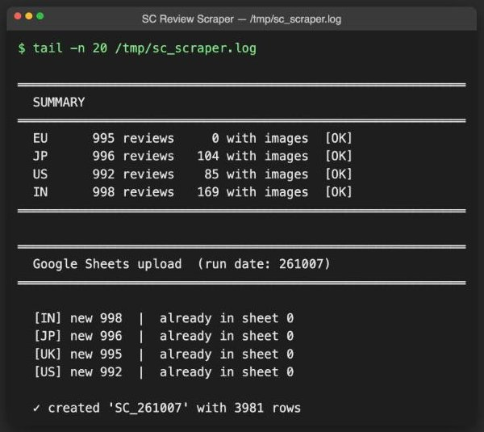
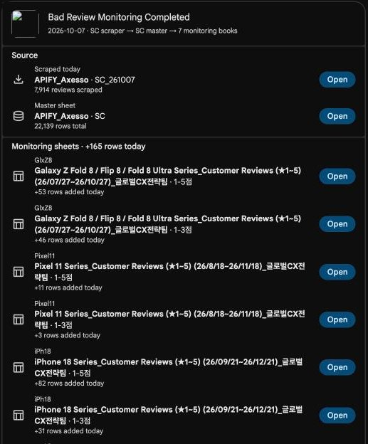

# Scrapers

Python scrapers and sheet pipelines that run locally (Mac, or the 24/7 server, see [`../ServerBootstrap`](../ServerBootstrap/README.md)) rather than in Apps Script.

## Screenshots

*SC Review Scraper run summary*

*Propagation completion card*

| Folder | What it does | Output | Runs | README |
|---|---|---|---|---|
| [SC_Review_Scraper](SC_Review_Scraper/) | Playwright scraper for Seller Central Brand Customer Reviews (US / EU (DE·IT·FR·ES·UK) / JP / IN) with image URLs + Order IDs | `<DOMAIN>_seller_central_reviews.csv` + `SC_{yymmdd}` tab on the source review sheet | On demand (`sc-scraper` skill); hourly LaunchAgent currently disabled; Apify Actor packaging | [README](SC_Review_Scraper/README.md) |
| [SC_Master_Propagate](SC_Master_Propagate/) | `SC_yymmdd` / `CaspiLM_yymmdd` → master `SC` → 8 product monitoring books, `tem` refresh, old-tab cleanup, "Bad Review Monitoring Completed" Chat card | Google Sheets + one Chat card | After each scrape / Caspi fetch (`sc-review-propagate` skill); dry-run unless `--commit` | [README](SC_Master_Propagate/README.md) |
| [Zendesk_Inquiry_Sync](Zendesk_Inquiry_Sync/) | Caspi Solved/Closed Zendesk tickets → `26년 전체문의` (A:AD, dedupe by Ticket ID) | Google Sheets + optional Chat notice | Per-user launchd / Task Scheduler schedule (`zendesk-inquiry-sync` skill) | [README](Zendesk_Inquiry_Sync/README.md) |
| [amazon_dp_scraper](amazon_dp_scraper/) | Headless async Playwright scraper for Amazon `/dp/` pages (rating, reviews, title, specs) on up to 8 domains, English + local language | `amazon_dp_<ts>.xlsx` (2 sheets) | On demand | [README](amazon_dp_scraper/README.md) |
| [amazon_child_asin_scraper](amazon_child_asin_scraper/) | Selenium: parent ASIN → child variants, per-child rating/review count, shared-review-pool flag | `asin_reviews_<ts>.csv` | On demand | [README](amazon_child_asin_scraper/README.md) |

Typical review-monitoring flow: **SC_Review_Scraper** (or "fetch from CaspiLM") writes a dated tab → **SC_Master_Propagate** distributes it to the monitoring books and posts the completion card.

Also here: `API_전체문의_20260914.csv`, a one-month Zendesk ticket export from Caspi/Snowflake (data snapshot). `SKU_ASIN_Filler/` (fills blank SKU/ASIN cells from Seller Central inventory; Mac launchd `com.spigen.gcx.sku-asin-filler`, every 5 min) exists locally but is not committed to git yet.

Shared credentials (paths only): Google OAuth token `~/.config/gws_shim/token.json`; Seller Central sessions in `~/.chrome-scraper-profile*`; Amazon customer cookies `~/.amazon_cookies.json`; Zendesk sync config `~/.config/zendesk_inquiry_sync/`.
