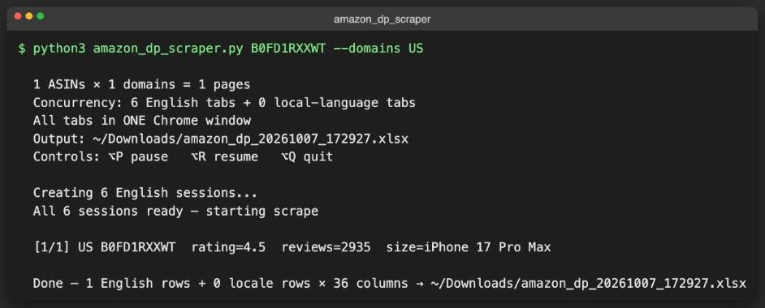

# amazon_dp_scraper.py

Async Playwright scraper for Amazon `/dp/` product detail pages. Scrapes rating, review count, title, brand, color, size, compatibility, "About this item", and all spec table attributes across up to 8 Amazon domains simultaneously. Outputs a live-written `.xlsx` file with two sheets — English results and local-language results.

## Screenshots


*One-ASIN run against amazon.com*

## Features

- **Headless Chromium** — no visible browser windows
- **SessionPool** — each concurrent slot gets an isolated `BrowserContext` so Amazon treats each as a distinct visitor
- **Dual-sheet output** — Sheet 1: English scrape; Sheet 2: local-language scrape (DE/FR/IT/ES/JP); same headers on both
- **Live write** — rows are appended to the `.xlsx` as they complete; file is readable mid-run
- **Robot-check recovery** — detects "continue shopping" pages and warms up the session via the homepage before retrying
- **Keyboard controls** (macOS, requires `pynput`): `⌥P` pause · `⌥R` resume · `⌥Q` quit

## Output

Written to `$AMAZON_DP_OUT_DIR` if set, else `~/Desktop` (env var added 2026-09-11 for the 24/7 server, together with a missing `import os` fix). If `openpyxl` isn't installed the script falls back to two CSVs, `amazon_dp_<ts>_en.csv` and `amazon_dp_<ts>_locale.csv`.

```
amazon_dp_YYYYMMDD_HHMMSS.xlsx
├── Sheet: amazon_dp_YYYYMMDD_HHMMSS       ← English results (US/UK/IN + en-US headers for all domains)
└── Sheet: amazon_dp_YYYYMMDD_HHMMSS_loc   ← Local-language results (DE/FR/IT/ES/JP only)
```

Columns captured (minimum; grows with new spec keys found):

| Column | Source |
|--------|--------|
| `domain` | CC code (US/UK/DE/…) |
| `asin` | Input ASIN |
| `url` | Full product URL |
| `productTitle` | `#productTitle` |
| `brand` | `#bylineInfo` / po-table / detail table |
| `color` | Variation selector / detail table / title |
| `size` | Variation selector / detail table / title regex |
| `compatibility` | Feature bullets / detail table |
| `About this item` | `#feature-bullets` |
| `rating` | Star rating (e.g. `4.5`) |
| `review_count` | Number of global ratings |
| `scraped_at` | Timestamp |
| *(dynamic)* | All `po-*` table rows + Item/Additional details rows |

## Usage

```bash
# Scrape the built-in ASIN list (RAW_ASINS: 92 Spigen ASINs; KR* internal codes are skipped) across all 8 domains
python3 amazon_dp_scraper.py

# Specific ASINs only
python3 amazon_dp_scraper.py B0G7QZ7RMD B0G7RYP439

# Specific ASINs + specific domains
python3 amazon_dp_scraper.py B0G7QZ7RMD B0G7RYP439 --domains US UK DE

# custom output folder
AMAZON_DP_OUT_DIR=/tmp/dp python3 amazon_dp_scraper.py B0G7QZ7RMD --domains US

# list the options (no browser is started)
python3 amazon_dp_scraper.py --help
```

## Configuration

| Constant | Default | Description |
|----------|---------|-------------|
| `CONCURRENCY` | `6` | Concurrent English scrape slots |
| `LOCAL_TABS` | `2` | Slots per non-English language pool |
| `PAGE_WAIT` | `2500 ms` | Wait after navigation before scraping |
| `PAGE_TIMEOUT` | `60000 ms` | Max page load time |
| `RAW_ASINS` | 102 codes | Default input list (entries starting with `KR` are dropped) |
| env `AMAZON_DP_OUT_DIR` | `~/Desktop` | Output folder |

## Dependencies

```
playwright (async_playwright)
openpyxl
pynput  (optional — keyboard controls)
```

Install:
```bash
pip install playwright openpyxl pynput
playwright install chromium
```

## Domain coverage

| Code | URL |
|------|-----|
| US | amazon.com |
| UK | amazon.co.uk |
| DE | amazon.de |
| FR | amazon.fr |
| IT | amazon.it |
| ES | amazon.es |
| JP | amazon.co.jp |
| IN | amazon.in |

English sessions are used for US, UK, IN. Local-language sessions (with `Accept-Language` header matching the country) are used for DE, FR, IT, ES, JP — those domains produce a row in both sheets.
