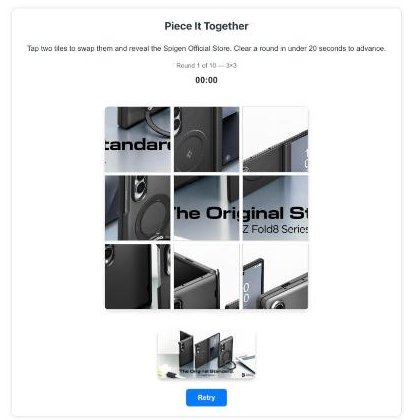

# Zendesk_Themes

Version-controlled export of the two Zendesk Guide Help Center themes used in the
Spigen GCX claim-form flow. Each theme is edited live via the Zendesk "Customize
design" (theming) editor in the browser — files here are a full local mirror for
version control, not a build artifact that gets deployed back automatically.

## Screenshots

*sq2gcx (Amazon) Help Center home*

*Piece It Together puzzle on the home page*

## Sites

| Folder | Zendesk brand | Theme ID | Purpose |
|--------|---------------|----------|---------|
| [`sq2gcx_AmazonHelpcenter/`](sq2gcx_AmazonHelpcenter/) | `sq2gcx.zendesk.com` (public: <https://sq2gcx.zendesk.com/hc/en-us>) | `01983e92-f744-4e6e-9b9e-16eac05b500f` | Help Center shown after a customer submits the **Amazon EU claim form**. Redirects shoppers to Amazon Store pages (DE/UK/FR/IT/ES/IN/JP). |
| [`spigen-eu_ShopifyHelpcenter/`](spigen-eu_ShopifyHelpcenter/) | `spigen-eu.zendesk.com` (public: <https://spigen-eu.zendesk.com/hc/en-gb>) | `c773e8a3-5558-4dc3-8620-c1802e889f3c` | Help Center shown after a customer submits the **Spigen EU (Shopify-run) claim form**. Redirects shoppers to Spigen's own Shopify storefronts (spigen.de/co.uk/fr/it/es). Community feature is not enabled on this brand, so the `community_*` templates are intentionally empty. |

Both themes share the same 20-template Zendesk Guide structure (`templates/*.hbs`)
plus theme-level `script.js` and `style.css`. `script.js` and `style.css` are
identical in the two themes (stock Copenhagen-style navigation and accessibility
JS). The differences are all in the templates: `home_page.hbs` (store links),
`header.hbs` / `footer.hbs` (community links and brand name), `new_request_page.hbs`
(only sq2gcx shows the red "US Support Link" banner sending Amazon US / non-EU
customers to `support.spigen.com`), and the `community_*` templates (empty on
spigen-eu). Per-theme details are in each folder's README.

## Home page layout (both themes)

From top to bottom, `home_page.hbs` contains:

1. **Shop Now flags.** sq2gcx: Amazon logo plus DE/UK/FR/IT/ES/IN/JP Amazon
   Store pages. spigen-eu: DE/UK/FR/IT/ES Spigen Shopify stores.
2. **YouTube player.** Muted autoplay that loops two video IDs in sequence,
   followed by a "Discover Our Latest Video Content" card.
3. **Official Spigen Store promo card.** Its links are rewritten client-side from
   `navigator.language`: sq2gcx picks the matching `amazon.<tld>` store page
   (default `co.uk`), spigen-eu picks `spigen.<tld>` (default `spigen.co.uk`).
4. **"Piece It Together" puzzle** (below).
5. **Instagram embed** of `@spigenuk`.

## `home_page.hbs` puzzle (sq2gcx + spigen-eu)

`home_page.hbs` on both sites includes an identical "Piece It Together"
sliding-image puzzle (built from the Spigen Official Store promo image,
tap-two-tiles-to-swap), all client-side, no backend. It's a 10-round
progression: round 1 is 3×3 (started at 4×4, but the banner's plain white
background made several tiles look blank, so it was shrunk to 3×3), and each
subsequent round steps up one size — 4×4, 5×5, ... up to 12×12 on round 10.
Grid sizing, tile size, and gap are computed dynamically per round (separate
desktop/mobile total sizes), not fixed CSS.

A live mm:ss.mmm timer runs per round. Clearing a round in under 20 seconds
auto-advances to the next round; finishing a round also triggers a tiered
canvas-confetti celebration based on absolute solve time (bronze/silver/gold —
pulsing border + funny MZ-slang message, no emojis anywhere in the UI). A
Retry button resets back to round 1. If 60 seconds pass without solving the
current round, the puzzle locks into a "game over" state (red border) until
Retry is pressed. The `.puzzle-container` has `overflow: hidden` so the
completed/game-over border clips correctly to the rounded corners.

An earlier version had a top-5 leaderboard backed by a Google Sheet + Apps
Script Web App; that was removed in favor of the confetti effects, and the
backend project (`GAS_Zendesk/PuzzleLeaderboard`) was deleted from the repo.
The Google Sheet / Script / Web App deployment it used still exist in Drive
but are now orphaned — not referenced by any live code — and can be deleted
manually if desired.

## Editing and publishing

Edits are made directly in the live theming editor via Playwright (CDP-attached to
the logged-in Chrome session for `kjw@spigen.com`), then mirrored back to this repo
and committed/pushed — see the `zendesk_theme_editing_workflow` memory for the
editor URL pattern and CodeMirror extraction details.

Editor URL pattern: `https://{subdomain}.zendesk.com/theming/editor/{themeId}/templates/{file}.hbs`
(`script.js` and `style.css` sit at the theme root, without `templates/`). The
editor is CodeMirror. After saving, check that the change is actually live on
the public Help Center (above) and isn't only saved as a draft.

To rebuild a theme from this repo instead (for example after a bad edit), zip a
folder's `templates/`, `script.js`, and `style.css` together with a
`manifest.json`, then upload it under **Guide admin → Customize design → Add
theme → Import**. `manifest.json` and `settings/`/`assets/` are **not** exported
here, so take them from a fresh "Export" of the live theme first. Publish only
after previewing.

`home_page.hbs` is the page a customer lands on immediately after claim-form
submission; it's the most frequently touched file in each theme.

Last code change: 2026-07-29 (puzzle rounds, retry, and game-over). Nothing in
either theme has changed since.
