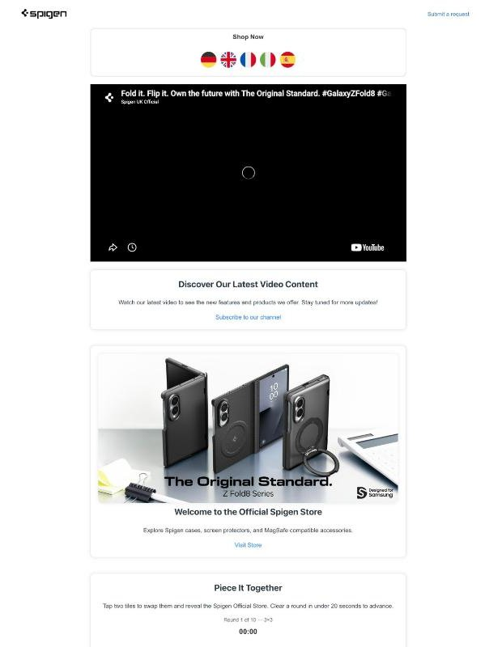

# spigen-eu_ShopifyHelpcenter

Zendesk Guide theme for the **Spigen EU (Shopify) Help Center** brand,
`spigen-eu.zendesk.com`. Customers land here after submitting the **Spigen EU
claim form** for orders from Spigen's own Shopify storefronts. The home page
links back to those stores instead of to Amazon.

## Screenshots

*Help Center home: Spigen store flag row, latest video, promo card*

*Piece It Together sliding puzzle, round 1 (3×3)*

| | |
|---|---|
| Public site | <https://spigen-eu.zendesk.com/hc/en-gb> (`/hc` and `/hc/en-us` redirect here) |
| Theme ID | `c773e8a3-5558-4dc3-8620-c1802e889f3c` |
| Editor | `https://spigen-eu.zendesk.com/theming/editor/c773e8a3-5558-4dc3-8620-c1802e889f3c/templates/home_page.hbs` (agent login required) |
| Last change | 2026-07-29 (puzzle ported from sq2gcx) |

## What's specific to this theme

- **Shop Now flags** (`home_page.hbs`) go to Spigen's Shopify stores:
  `spigen.de`, `spigen.co.uk`, `spigen.fr`, `spigen.it`, `spigen.es`. There is no
  Amazon logo and no IN/JP.
- **Store promo card** links are rewritten from `navigator.language` to
  `https://spigen.<tld>` (de / fr / it / es, default `spigen.co.uk`).
- **`new_request_page.hbs`** is the plain request form. It has no US-support
  banner and no breadcrumbs.
- **Community is not enabled on this brand.** The four `community_*` templates
  are intentionally empty (0 bytes), and the header and mobile menu have no
  Community link. The header logo has no alt text or brand name, and the footer
  omits the Help Center name link.

The rest is shared with [`sq2gcx_AmazonHelpcenter`](../sq2gcx_AmazonHelpcenter/):
the YouTube sequential player, the Instagram embed, the 10-round puzzle (see the
[root README](../README.md#home_pagehbs-puzzle-sq2gcx--spigen-eu)), and identical
`script.js` / `style.css`.

## Files

| Path | Notes |
|------|-------|
| `templates/home_page.hbs` | Landing page after claim-form submit (flags, video, promo, puzzle, Instagram). Most-edited file. |
| `templates/new_request_page.hbs` | Claim/request form page (`{{request_form wysiwyg=true}}`) |
| `templates/header.hbs`, `footer.hbs` | Logo, nav (no Community), footer |
| `templates/community_*.hbs` | Empty on purpose |
| `templates/*.hbs` (others) | Stock article / section / category / search / profile / request templates |
| `script.js`, `style.css` | Theme-level JS and CSS (same as sq2gcx) |

## Editing / publishing

Edit live in the theming editor (CodeMirror; Playwright CDP-attached to the
logged-in `kjw@spigen.com` Chrome session), then copy the file back here and
commit. Changes to the shared puzzle usually have to be made in **both** themes.
Check <https://spigen-eu.zendesk.com/hc/en-gb> afterwards to confirm the change
is actually live. To restore from git, see
[Editing and publishing](../README.md#editing-and-publishing) in the root README.
