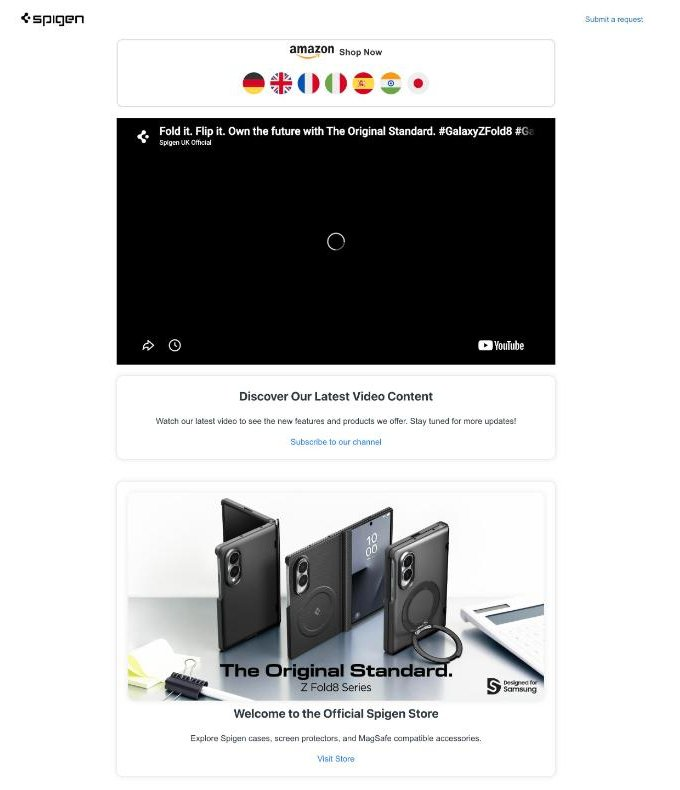

# sq2gcx_AmazonHelpcenter

Zendesk Guide theme for the **Amazon Help Center** brand, `sq2gcx.zendesk.com`.
Customers land here after submitting the **Amazon EU claim form**. The home page
sends them on to Spigen's Amazon Store pages and keeps them engaged with videos,
the store promo, and the "Piece It Together" puzzle.

## Screenshots

*Help Center home: Amazon Shop Now flag row, latest video, promo card*

| | |
|---|---|
| Public site | <https://sq2gcx.zendesk.com/hc/en-us> |
| Theme ID | `01983e92-f744-4e6e-9b9e-16eac05b500f` |
| Editor | `https://sq2gcx.zendesk.com/theming/editor/01983e92-f744-4e6e-9b9e-16eac05b500f/templates/home_page.hbs` (agent login required) |
| Last change | 2026-07-29 |

## What's specific to this theme

- **Shop Now flags** (`home_page.hbs`) go to the Spigen **Amazon Store** page for
  each marketplace: DE, UK, FR, IT, ES, IN, JP. The links carry
  `maas` / `channel=GCX` / `channel=Zendesk` tracking parameters.
- **Store promo card** links are rewritten from `navigator.language` to
  `https://www.amazon.<tld>/stores/page/9ACCFF27-…` (de / fr / it / es / co.jp /
  com for `en-US`, default `co.uk`).
- **`new_request_page.hbs`** shows a red **"US Support Link"** banner above the
  form. It sends Amazon US customers (non-EU, India, Japan) to the Zoho desk at
  `support.spigen.com`, plus breadcrumbs.
- **Community is enabled**: the `community_*` templates are full stock templates,
  and the header and mobile menu include a Community link. The footer shows the
  Help Center name.

The rest is shared with [`spigen-eu_ShopifyHelpcenter`](../spigen-eu_ShopifyHelpcenter/):
the YouTube sequential player, the Instagram embed, the 10-round puzzle (see the
[root README](../README.md#home_pagehbs-puzzle-sq2gcx--spigen-eu)), and identical
`script.js` / `style.css`.

## Files

| Path | Notes |
|------|-------|
| `templates/home_page.hbs` | Landing page after claim-form submit (flags, video, promo, puzzle, Instagram). Most-edited file. |
| `templates/new_request_page.hbs` | Claim/request form page (`{{request_form wysiwyg=true}}`) plus the US Support banner |
| `templates/header.hbs`, `footer.hbs` | Logo, nav (incl. Community), footer |
| `templates/*.hbs` (others) | Stock article / section / category / search / profile / request templates |
| `script.js`, `style.css` | Theme-level JS and CSS (same as spigen-eu) |

## Editing / publishing

Edit live in the theming editor (CodeMirror; Playwright CDP-attached to the
logged-in `kjw@spigen.com` Chrome session), then copy the file back here and
commit. Check <https://sq2gcx.zendesk.com/hc/en-us> afterwards to confirm the
change is actually live. To restore from git, see
[Editing and publishing](../README.md#editing-and-publishing) in the root README
(zip with the live theme's `manifest.json`, then Import).
